# QueueCare AI — System Architecture Document

**Product:** QueueCare AI — AI-Based Smart Hospital Queue Management and Wait Time Prediction System
**Document ID:** 10
**Version:** 1.0 (Draft)
**Status:** Pending Approval
**Last Updated:** August 1, 2026
**Author:** Ram Chauhan
**Related Documents:** `05_Product_Requirements_Document.md`, `08_User_Experience.md`, `09_UI_UX_Design.md`

---

## Table of Contents

1. [Introduction](#1-introduction)
2. [Architecture Goals](#2-architecture-goals)
3. [System Overview](#3-system-overview)
4. [High-Level Architecture](#4-high-level-architecture)
5. [Architecture Style](#5-architecture-style)
6. [Major Components](#6-major-components)
7. [Component Responsibilities](#7-component-responsibilities)
8. [Data Flow](#8-data-flow)
9. [Authentication Flow](#9-authentication-flow)
10. [Module Interaction](#10-module-interaction)
11. [Deployment Architecture](#11-deployment-architecture)
12. [Third-Party Integrations](#12-third-party-integrations)
13. [Scalability Strategy](#13-scalability-strategy)
14. [Performance Considerations](#14-performance-considerations)
15. [Security Overview](#15-security-overview)
16. [Error Handling Strategy](#16-error-handling-strategy)
17. [Logging and Monitoring](#17-logging-and-monitoring)
18. [Future Scalability](#18-future-scalability)
19. [Architecture Decision Summary](#19-architecture-decision-summary)
20. [Conclusion](#20-conclusion)

---

## 1. Introduction

### 1.1 Purpose

This document defines the complete software architecture for QueueCare AI — an AI-powered hospital queue management and wait-time prediction platform designed for healthcare facilities in India. It serves as the authoritative technical reference for software architects, senior developers, technical leads, and technical reviewers involved in the design, implementation, and review of the system.

This document covers:
- System context and component boundaries
- Technology stack selection with rationale
- Frontend and backend architecture
- AI/ML pipeline design
- Authentication and authorisation model
- Real-time data flow and queue state management
- Notification service architecture
- Deployment strategy and environment model
- Security, performance, and scalability considerations
- Error handling and observability approach

This document does not include implementation code, database schema definitions (addressed in a separate data model document), or UI/UX design specifications (addressed in `09_UI_UX_Design.md`).

### 1.2 Product Context

QueueCare AI is a multi-tenant SaaS platform serving four user roles across two interface surfaces:

| Interface | Users | Primary Device |
|-----------|-------|---------------|
| Patient Mobile App (Progressive Web App) | Patients | Smartphone |
| Staff Web Dashboard | Receptionists, Doctors, Hospital Administrators | Desktop/Laptop browser |

The platform's defining capabilities are:
- Real-time digital queue management replacing paper token systems
- AI-driven wait-time prediction using session history
- Push notifications at critical queue milestones
- Multi-role, multi-department, multi-hospital SaaS architecture

### 1.3 Technology Stack Summary

| Layer | Technology | Rationale |
|-------|-----------|-----------|
| Frontend (Web) | React (Vite) | Component-based SPA, strong ecosystem, optimal for real-time UI updates |
| Backend API | FastAPI (Python) | High performance async Python framework; native ML/AI integration |
| Database | PostgreSQL | Relational integrity for multi-tenant queue data; strong indexing |
| Authentication | Firebase Authentication | Managed OTP/phone auth; eliminates custom SMS OTP infrastructure |
| Push Notifications | Firebase Cloud Messaging (FCM) | Reliable, free-tier cross-platform push delivery |
| AI/ML | scikit-learn (Python) | Lightweight, production-ready ML for wait-time regression models |
| Real-time | WebSockets (via FastAPI) | Bidirectional real-time queue state push to all connected clients |
| Deployment | Docker + Cloud (GCP / Railway / Render) | Containerised, portable, horizontally scalable |

Full rationale for each decision is provided in Section 19.

---

## 2. Architecture Goals

The architecture must satisfy the following goals. Each goal directly addresses a product requirement or operational constraint.

| ID | Goal | Rationale |
|----|------|-----------|
| AG-01 | **Real-time queue state delivery** — queue changes reach all connected clients within 5 seconds | Core product promise: live queue tracking without manual refresh |
| AG-02 | **Sub-3-second API response times** for all standard operations under normal load | Staff dashboards must be fast enough for peak-hour use (60-second token issuance target) |
| AG-03 | **99% uptime during hospital operating hours** (6 AM – 10 PM) | Hospitals depend on the platform for OPD operations; downtime directly impacts patient care |
| AG-04 | **Multi-tenant data isolation** — each hospital's data is logically isolated with no cross-hospital data leakage | Regulatory requirement; customer trust requirement |
| AG-05 | **Stateless, horizontally scalable backend** — the API layer can be scaled by adding instances without architectural changes | Supports growth from 5 hospitals to 50+ without redesign |
| AG-06 | **Minimal operational overhead for a single developer** during the prototype phase | System complexity must match the team size; simple deployment, managed services preferred over self-hosted infrastructure |
| AG-07 | **AI predictions integrated into the same codebase** as the backend — no separate ML service at MVP | Reduces operational complexity for v1; scikit-learn models are lightweight enough to run in-process |
| AG-08 | **Mobile-first patient experience** via Progressive Web App — no App Store distribution required for v1 | Removes friction for hospital adoption; patients visit a URL, not an app store |

---

## 3. System Overview

QueueCare AI consists of five user-facing frontends, a unified backend API, an embedded AI engine, a PostgreSQL database, and two managed external services (Firebase Auth and FCM).

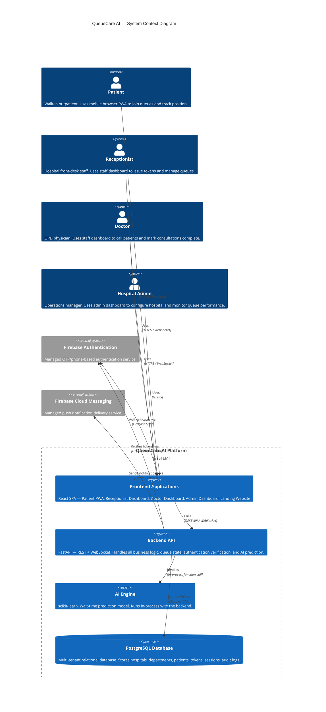

### 3.1 Key Architectural Boundaries

| Boundary | Description |
|----------|-------------|
| **Frontend / Backend** | All business logic lives in the backend. The frontend is a thin presentation layer that renders data and captures user intent. |
| **Backend / AI Engine** | The AI prediction module is embedded within the FastAPI application process at MVP. It is invoked as an in-process function call — not a separate service. |
| **Backend / Firebase** | Firebase handles only authentication and notification delivery. All other logic (queue management, session control, analytics) is owned by the QueueCare AI backend. |
| **Multi-tenancy boundary** | Hospital data isolation is enforced at the database query level via `hospital_id` scoping on all data access functions. No cross-tenant query is possible through the API. |

---

## 4. High-Level Architecture

The following diagram shows the layered architecture of QueueCare AI. Each layer has a clearly defined responsibility and communicates only with the layers immediately adjacent to it.

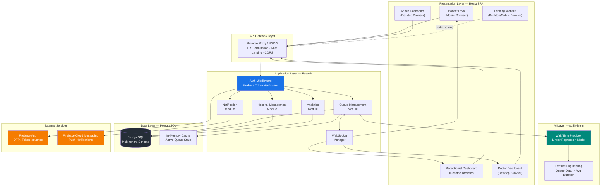

### 4.1 Layer Responsibilities

| Layer | Technology | Responsibility |
|-------|-----------|---------------|
| **Presentation** | React (Vite) | Render UI, manage local state, handle WebSocket connections, call REST APIs |
| **API Gateway** | NGINX | TLS termination, reverse proxy, rate limiting, CORS headers, request routing |
| **Application** | FastAPI | Business logic, authentication middleware, queue state management, API endpoints |
| **AI** | scikit-learn | In-process wait-time prediction — takes queue features, returns estimated duration range |
| **Data** | PostgreSQL | Persistent storage for all application data — hospitals, queues, tokens, sessions, audit |
| **External** | Firebase Auth + FCM | OTP-based authentication; push notification delivery |

---

## 5. Architecture Style

### 5.1 Selected Style: Modular Monolith

QueueCare AI v1 uses a **modular monolith** architecture — a single deployable backend application organised into well-defined internal modules with clear boundaries, rather than a microservices architecture.

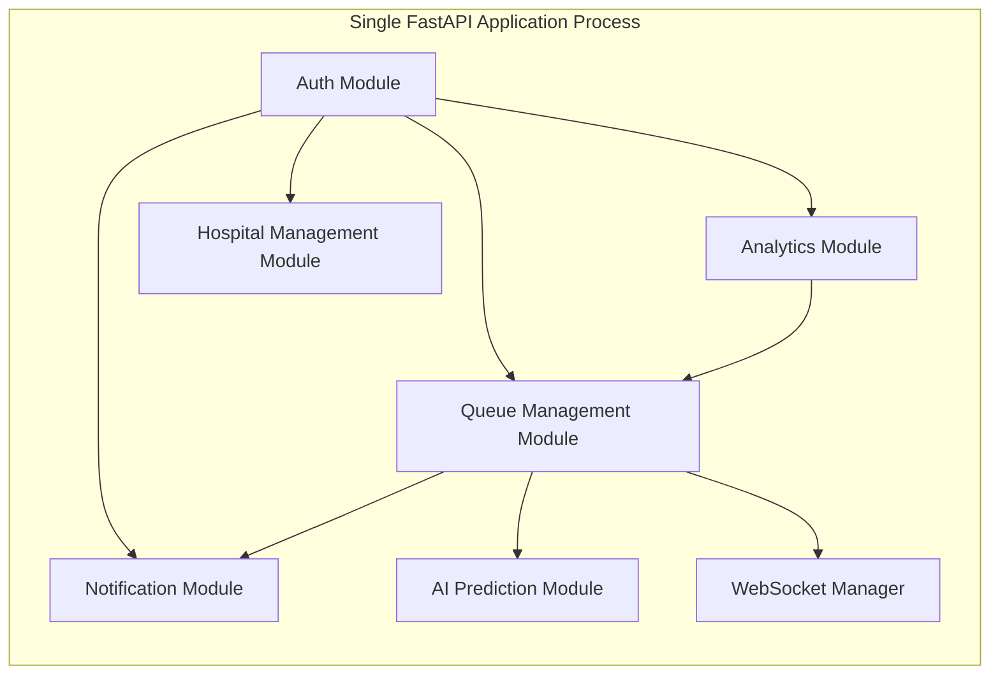

### 5.2 Why Modular Monolith (Not Microservices)

| Criterion | Modular Monolith | Microservices |
|-----------|----------------|--------------|
| Developer count (v1) | ✅ Optimal for 1 developer | ❌ Requires DevOps expertise + multiple deployment pipelines |
| Operational complexity | ✅ Single deployment unit | ❌ Service discovery, inter-service networking, distributed tracing |
| Inter-module communication | ✅ In-process function calls — zero latency | ❌ HTTP/gRPC network hops add latency and failure points |
| AI integration | ✅ scikit-learn runs in-process — no model serving infrastructure needed | ❌ Requires a separate model serving service (e.g., MLflow, TorchServe) |
| Debugging and testing | ✅ Single process, single log stream, simple integration tests | ❌ Distributed debugging across multiple services |
| Future migration path | ✅ Well-defined module boundaries make future extraction to microservices straightforward | — |
| Time to working prototype | ✅ Weeks | ❌ Months |

**Decision:** A modular monolith is the correct choice for a single-developer, 6-month prototype. The module boundaries are defined such that each module (Queue, Hospital, Notification, Analytics, AI) can be extracted into an independent service in a future release without changes to the business logic within the module.

### 5.3 Communication Patterns

QueueCare AI uses two communication patterns:

| Pattern | Used For | Technology |
|---------|---------|-----------|
| **Request/Response (REST)** | All administrative actions, data mutations, report queries | FastAPI REST endpoints (HTTP/1.1 + JSON) |
| **Server Push (WebSocket)** | Real-time queue state updates to connected patients, receptionists, and doctors | FastAPI WebSocket (RFC 6455) |

**Why WebSockets instead of polling or SSE:**
- **Polling** (periodic GET requests) introduces latency equal to the poll interval and wastes bandwidth — unacceptable for a 5-second update target with 500 concurrent users
- **Server-Sent Events (SSE)** are unidirectional — adequate for patient-only updates but insufficient for staff dashboards that need bidirectional communication (e.g., sending a "call patient" action and immediately receiving the updated queue state)
- **WebSockets** provide bidirectional, low-latency, connection-efficient real-time communication — ideal for the queue state synchronisation use case

### 5.4 API Design: REST Principles

All REST endpoints follow these conventions:

| Convention | Standard |
|-----------|---------|
| URL structure | `/{version}/{resource}/{id}/{sub-resource}` (e.g., `/v1/hospitals/{hospital_id}/departments`) |
| HTTP verbs | GET (read), POST (create), PUT (full update), PATCH (partial update), DELETE (soft delete) |
| Response format | JSON with consistent envelope: `{ "data": ..., "meta": ..., "error": null }` |
| Versioning | URI versioning — `/v1/` prefix on all API routes |
| Pagination | Cursor-based pagination for list endpoints returning large datasets |
| Error format | `{ "error": { "code": "QUEUE_FULL", "message": "...", "details": {...} } }` |

---

## 6. Major Components

### 6.1 Landing Website

**Technology:** React (static export) or plain HTML/CSS/JS
**Deployment:** Separate static hosting (Netlify / Vercel / Firebase Hosting)
**Purpose:** Marketing and conversion page for hospital decision-makers. Not part of the application runtime.

The landing website is intentionally kept separate from the main React SPA to:
- Avoid coupling marketing content deployments with application deployments
- Enable independent caching and CDN optimisation
- Allow the landing page to be updated without any risk to the running application

The landing website communicates with no backend services. It contains only static content: product overview, feature descriptions, call-to-action forms (which submit to a contact email or simple form service), and links to the application login pages.

---

### 6.2 Patient Portal (Progressive Web App)

**Technology:** React (Vite) with PWA manifest and service worker
**Hosting:** Static build served via CDN
**Access pattern:** Mobile browser — no App Store installation required

The Patient Portal is a **Progressive Web App (PWA)**. This design decision allows patients to access QueueCare AI by visiting a URL in their mobile browser without downloading anything from an app store. The hospital can print a short URL on posters alongside the department QR codes.

**Key architectural characteristics:**

| Characteristic | Implementation |
|---------------|---------------|
| **State management** | React Context + `useReducer` for queue state; no complex state library needed at MVP scale |
| **Real-time updates** | Single persistent WebSocket connection per active session. Reconnects automatically on disconnect. |
| **QR code scanning** | Browser-native camera API (`getUserMedia`) + ZXing-js QR decoder library — no native app required |
| **Offline behaviour** | Service worker caches the app shell. When connectivity is lost, the last known queue state is shown with a connectivity warning banner. Data updates resume automatically on reconnect. |
| **Push notifications** | FCM web push via the Firebase JS SDK. Patient must grant notification permission on first use. |
| **Authentication** | Firebase Authentication JS SDK — OTP via SMS, session persisted in browser storage |
| **Route structure** | `/` — Home / Dashboard, `/hospitals` — Hospital list, `/queue/:token_id` — Active queue screen, `/profile` — Profile |

**WebSocket subscription model:**
When a patient holds an active token, the Patient Portal establishes a WebSocket connection to the endpoint `/ws/queue/{department_id}`. The server broadcasts queue state updates to all clients subscribed to that department channel. The client updates local state and re-renders the queue position and estimate in real time.

---

### 6.3 Doctor Portal

**Technology:** React (Vite) — standard SPA
**Hosting:** Same static build as staff dashboard (different route namespace)
**Access pattern:** Desktop/laptop browser

The Doctor Portal is a focused, single-screen operational dashboard used in short bursts between consultations. Its architectural priority is speed and reliability — the interface must render the latest queue state correctly and immediately when the doctor looks up from a consultation.

**Key architectural characteristics:**

| Characteristic | Implementation |
|---------------|---------------|
| **Real-time updates** | WebSocket subscription to `/ws/queue/{department_id}` — same channel as patients and receptionists. All connected staff see the same queue state. |
| **State management** | React Context for the active queue state. Minimal — the queue is the only state that matters on this screen. |
| **Authentication** | Firebase Auth via the Firebase SDK; ID token attached to all API requests and the WebSocket upgrade handshake |
| **Route structure** | `/staff/doctor/queue` — Primary queue dashboard, `/staff/settings` — Account settings |
| **Actions** | Call Next Patient, Mark Complete, Mark No-Show, Reorder — all REST API calls. WebSocket broadcasts the resulting state change to all subscribers. |

---

### 6.4 Reception Portal

**Technology:** React (Vite) — standard SPA
**Hosting:** Same static build as staff dashboard
**Access pattern:** Desktop/laptop browser at a fixed workstation

The Reception Portal is the highest-frequency operational interface in the system. During peak hour, a receptionist may perform 80–130 patient registrations per session. Every design and architectural decision for this component prioritises time-to-action.

**Key architectural characteristics:**

| Characteristic | Implementation |
|---------------|---------------|
| **Patient search** | Debounced real-time search — API call fires 300ms after the last keystroke. Returns patient records matching the phone number prefix. Displays inline in a dropdown below the search field. |
| **Real-time queue** | WebSocket subscription to the assigned department channel — queue list updates live without page interaction |
| **Token issuance** | POST `/v1/queues/{department_id}/tokens` — synchronous REST call. Response contains the issued token object including position and wait estimate. |
| **Session control** | PATCH `/v1/sessions/{session_id}` — updates session status (open, paused, resumed, closed) |
| **Priority flagging** | PATCH `/v1/tokens/{token_id}` — updates priority category; backend recalculates queue order and broadcasts update |
| **Authentication** | Firebase Auth ID token in Authorization header on all requests |
| **Route structure** | `/staff/reception/queue` — Primary dashboard |

---

### 6.5 Admin Portal

**Technology:** React (Vite) — standard SPA
**Hosting:** Same static build as staff dashboard
**Access pattern:** Desktop/laptop browser

The Admin Portal is used less frequently than the reception or doctor dashboards but requires access to broader data — live overview across all departments, historical analytics, staff and department configuration. The admin does not need a persistent WebSocket connection for the overview; periodic polling or lightweight refresh on focus is acceptable for the admin use case.

**Key architectural characteristics:**

| Characteristic | Implementation |
|---------------|---------------|
| **Live overview** | Lightweight polling — GET `/v1/hospitals/{hospital_id}/overview` every 10 seconds. Returns summary stats for all active departments. A WebSocket connection is not required at MVP given the admin's monitoring (not real-time operational) use case. |
| **Department drill-in** | On card click: GET `/v1/departments/{department_id}/queue` — loads the full queue list. This view does subscribe to a WebSocket for live updates during the drill-in session. |
| **Analytics** | GET `/v1/analytics/sessions?range=30d` — returns paginated historical session data. Rendered as a table. |
| **Configuration** | Standard CRUD REST calls — POST/PUT/PATCH/DELETE for hospitals, departments, staff accounts |
| **Staff management** | GET/POST/PATCH `/v1/staff` — list, create, update, deactivate staff accounts |
| **Audit log** | GET `/v1/audit-log?filters=...` — server-side filtered, paginated, read-only |
| **Route structure** | `/staff/admin/overview`, `/staff/admin/analytics`, `/staff/admin/staff`, `/staff/admin/settings`, `/staff/admin/audit` |

---

### 6.6 Backend API — FastAPI Application

**Technology:** FastAPI (Python 3.11+)
**Deployment:** Docker container
**Port:** 8000 (internal), exposed via NGINX reverse proxy

FastAPI is the central application layer. All business logic, authentication verification, queue state management, and data access live here. It exposes both REST endpoints and WebSocket endpoints.

**Why FastAPI:**
- **Performance:** FastAPI is one of the fastest Python web frameworks — benchmarks comparable to Node.js and Go for I/O-bound workloads
- **Async support:** Native `async`/`await` throughout — essential for handling WebSocket connections and concurrent database queries without blocking
- **Python ecosystem:** First-class access to scikit-learn, NumPy, and the broader Python ML ecosystem — no language boundary between the API and the AI engine
- **Automatic documentation:** Swagger UI and ReDoc generated automatically from type annotations — reduces documentation burden
- **Type safety:** Pydantic v2 models for all request/response schemas — reduces a class of runtime errors

**Internal module structure:**

```
backend/
├── main.py                    # FastAPI app entry point, router registration
├── auth/                      # Firebase token verification middleware
├── modules/
│   ├── queue/                 # Queue management: tokens, positions, states
│   ├── hospital/              # Hospital and department CRUD
│   ├── session/               # Session lifecycle management
│   ├── notification/          # FCM push notification sending
│   ├── analytics/             # Session analytics and CSV export
│   ├── audit/                 # Audit log write and read
│   └── ai/                    # Wait-time prediction (scikit-learn)
├── websocket/                 # WebSocket connection manager and broadcast
├── db/                        # Database connection, session factory
├── models/                    # SQLAlchemy ORM models
├── schemas/                   # Pydantic request/response schemas
├── core/                      # Config, constants, security utilities
└── tests/                     # Unit and integration tests
```

**WebSocket Manager:**
The WebSocket Manager maintains a dictionary of active connections keyed by `department_id`. When a queue state change occurs (any token status update, priority change, queue pause/resume), the Queue module notifies the WebSocket Manager, which broadcasts the updated queue state to all connections subscribed to that `department_id`. This is a channel-per-department pub/sub pattern.

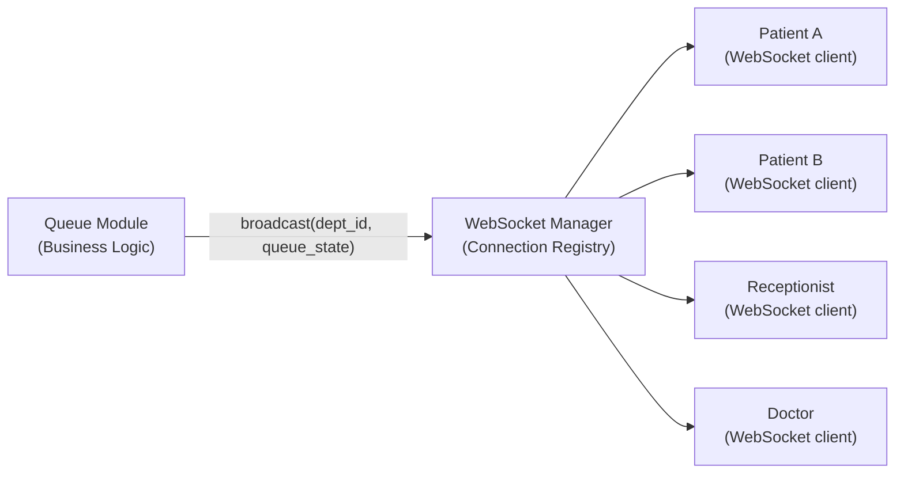

---

### 6.7 AI Engine — Wait-Time Prediction Module

**Technology:** scikit-learn (Python), Linear Regression (v1)
**Deployment:** In-process within the FastAPI application
**Invocation:** Synchronous function call from the Queue module

**Why in-process (not a separate service):**
At MVP, the prediction model is a lightweight scikit-learn estimator. Its inference time is measured in microseconds — well under 1ms. Deploying it as a separate service (e.g., via a REST API or gRPC) would add network round-trip latency, infrastructure complexity, and a new failure point — none of which are justified by the model's computational requirements.

**Prediction model (v1):**

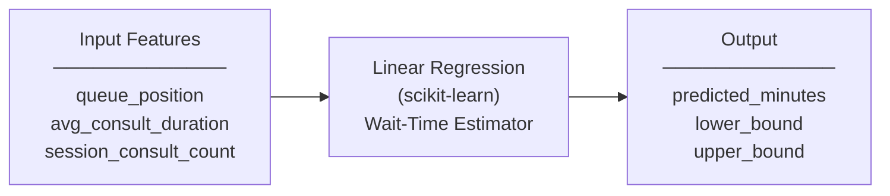

**Feature engineering:**
| Feature | Source | Description |
|---------|--------|-------------|
| `queue_position` | Queue state | The patient's current position in the queue (1-indexed) |
| `avg_consult_duration` | Session history | Rolling average consultation duration (seconds) for the current session |
| `session_consult_count` | Session history | Number of consultations completed so far in the current session |

**Output:**
The model returns a predicted wait time in minutes as a point estimate. The application converts this to a range by applying ±20% bounds: `lower = prediction * 0.8`, `upper = prediction * 1.2`. This range is displayed to the patient as "approximately X–Y minutes."

**Cold-start handling:**
If fewer than 5 consultations have been completed in the current session and no prior session data exists for the department, the model returns a `null` estimate. The API returns `{ "estimate": null, "message": "Estimate not yet available" }` and the frontend displays the appropriate "not yet available" state.

**Model training:**
At MVP, the model is trained on simulated session data generated during development. In production, the model will be retrained weekly using real session data accumulated in PostgreSQL. The retrained model object is serialised using `joblib` and loaded on application startup.

---

### 6.8 Database — PostgreSQL

**Technology:** PostgreSQL 15+
**Deployment:** Managed cloud PostgreSQL (e.g., Supabase, Railway, or Google Cloud SQL)
**ORM:** SQLAlchemy (async) with Alembic for migrations

**Why PostgreSQL:**
- **Relational integrity:** Queue management is inherently relational — tokens belong to sessions, sessions belong to departments, departments belong to hospitals. Foreign key constraints enforce referential integrity that a document store cannot.
- **Multi-tenant row-level security:** PostgreSQL's Row-Level Security (RLS) policies provide an additional layer of multi-tenant isolation on top of application-level `hospital_id` filtering.
- **ACID transactions:** Token issuance must be atomic — two concurrent requests cannot receive the same token number. PostgreSQL's `SELECT ... FOR UPDATE` and sequence-based auto-increment ensure correctness under concurrent load.
- **JSON support:** `JSONB` columns store flexible metadata (e.g., audit event details, notification payloads) without schema migrations for every new field.
- **Analytics:** PostgreSQL's window functions and aggregation support complex analytics queries (average wait times, patient volume by hour) without a separate analytics database.

**Multi-tenancy model:**
QueueCare AI uses a **shared schema, tenant-discriminator** multi-tenancy model. All hospitals share the same set of tables. Every query is scoped by `hospital_id` at the application layer. This is the simplest multi-tenancy model and appropriate for the v1 scale (< 50 hospitals).

All major tables include `hospital_id` as a non-nullable foreign key. The application's data access layer enforces this scope on every query. No API endpoint exposes data without first verifying the requesting user's `hospital_id` matches the resource being accessed.

**Core entities (logical, not schema):**

| Entity | Key Attributes |
|--------|---------------|
| `hospitals` | id, name, address, created_by, created_at |
| `departments` | id, hospital_id, name, max_capacity, session_time, notification_threshold, status |
| `staff_accounts` | id, hospital_id, role, name, phone, is_active |
| `patient_accounts` | id, phone, name, age, gender, created_at |
| `sessions` | id, department_id, date, status, opened_at, closed_at |
| `tokens` | id, session_id, patient_id, token_number, priority, status, issued_at, called_at, served_at |
| `audit_log` | id, hospital_id, actor_id, actor_role, action_type, target_type, target_id, details, created_at |
| `notification_log` | id, patient_id, token_id, type, sent_at, delivered_at, status |

---

### 6.9 Notification Service — FCM Integration

**Technology:** Firebase Cloud Messaging (FCM) via Firebase Admin SDK (Python)
**Deployment:** In-process within the FastAPI application
**Invocation:** Called by the Queue module when a notification trigger condition is met

**Notification flow:**

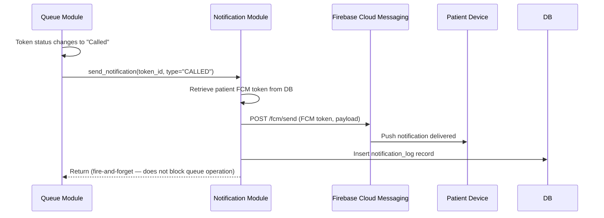

**Fire-and-forget pattern:**
Notification delivery is non-blocking. The Queue module dispatches a notification task and immediately continues processing. A failed notification does not roll back the queue state change. This ensures that push notification infrastructure failures cannot disrupt core queue operations.

**Notification types and triggers:**

| Notification Type | Trigger Condition | FCM Data Payload |
|------------------|------------------|-----------------|
| `APPROACHING` | Patients ahead count reaches department threshold | `{ type, token_number, department_name, patients_ahead }` |
| `NEXT_IN_QUEUE` | Exactly 1 patient ahead | `{ type, token_number, department_name }` |
| `CALLED` | Token status set to "Called" | `{ type, token_number, department_name, action: "proceed" }` |
| `QUEUE_PAUSED` | Session status set to "Paused" | `{ type, department_name, reason }` |
| `TOKEN_SKIPPED` | Token status set to "No-Show" | `{ type, token_number, department_name }` |

**FCM token management:**
Each patient's FCM device token is stored in the `patient_accounts` table and refreshed by the client SDK when Firebase issues a new token. The backend updates the stored token on each API call that includes a fresh FCM token in the request header.

---

## 7. Component Responsibilities

This table defines what each component owns — what it is responsible for — and, equally importantly, what it does not own. Clear ownership boundaries prevent logic duplication and cross-component coupling.

| Component | Technology | Owns | Does Not Own |
|-----------|-----------|------|-------------|
| **Patient Portal** | React PWA | Queue join UI, live position display, QR scanning, notification permission handling, patient-side state | Business logic, authentication token issuance, queue state calculation |
| **Doctor Portal** | React SPA | Call Next UI, Mark Complete UI, queue list display, doctor-side state | Authentication, queue ordering logic, notification sending |
| **Reception Portal** | React SPA | Token issuance UI, patient search/registration, queue status controls, priority flagging UI, session controls | Business logic, notification delivery, wait-time calculation |
| **Admin Portal** | React SPA | Overview display, analytics display, staff/dept configuration UI, audit log display | Real-time operations, business logic, queue state management |
| **FastAPI — Queue Module** | FastAPI | Token issuance logic, queue ordering, priority repositioning, token status transitions, session state, WebSocket broadcast trigger | Authentication token verification, notification delivery, prediction computation |
| **FastAPI — Hospital Module** | FastAPI | Hospital and department CRUD, staff account management, department configuration, QR code generation | Queue operations, patient authentication, notifications |
| **FastAPI — Auth Middleware** | FastAPI + Firebase Admin SDK | Firebase ID token verification, role extraction, hospital_id binding, request context injection | Token issuance, OTP delivery, session persistence |
| **FastAPI — Analytics Module** | FastAPI | Session summary calculation, historical data aggregation, CSV export generation | Queue operations, real-time state, notifications |
| **FastAPI — Audit Module** | FastAPI | Writing immutable audit log entries for all significant queue and admin actions | Reading queue state, triggering any side effects |
| **AI Engine** | scikit-learn | Wait-time point estimate calculation, cold-start detection, confidence range generation | Queue state reads/writes, notification triggers, model training (done offline) |
| **PostgreSQL** | PostgreSQL 15 | Persistent storage for all application data, ACID transaction guarantees, multi-tenant data isolation | Business logic, authentication, push delivery |
| **Notification Module** | FastAPI + Firebase Admin SDK | FCM notification sending, notification log writing, fire-and-forget dispatch | Queue state changes, patient preference checking (delegated to caller) |
| **WebSocket Manager** | FastAPI WebSocket | Connection registry keyed by department_id, broadcasting queue state to all subscribers | Computing queue state, triggering notifications |
| **Firebase Authentication** | Firebase (external) | OTP delivery via SMS, ID token issuance and rotation, token revocation | Any application business logic |
| **Firebase Cloud Messaging** | FCM (external) | Device push notification delivery | Notification content decisions, patient preference management |

---

## 8. Data Flow

### 8.1 Patient Queue Join Flow

This sequence shows the complete data flow when a patient scans a department QR code and receives a queue token.

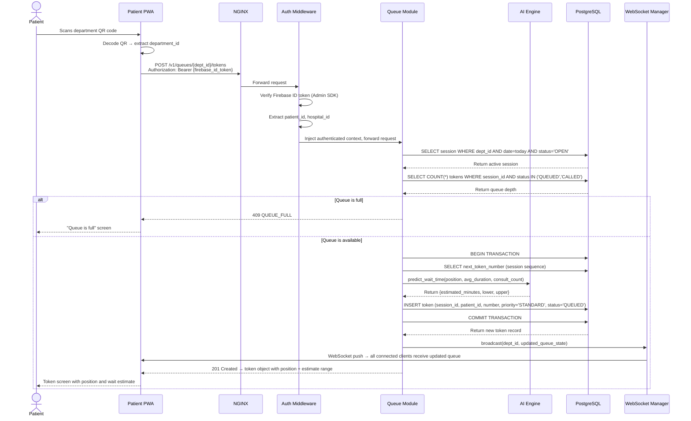

### 8.2 Wait-Time Prediction Recalculation Flow

This sequence shows how wait-time estimates are updated for all queued patients when a consultation is marked complete.

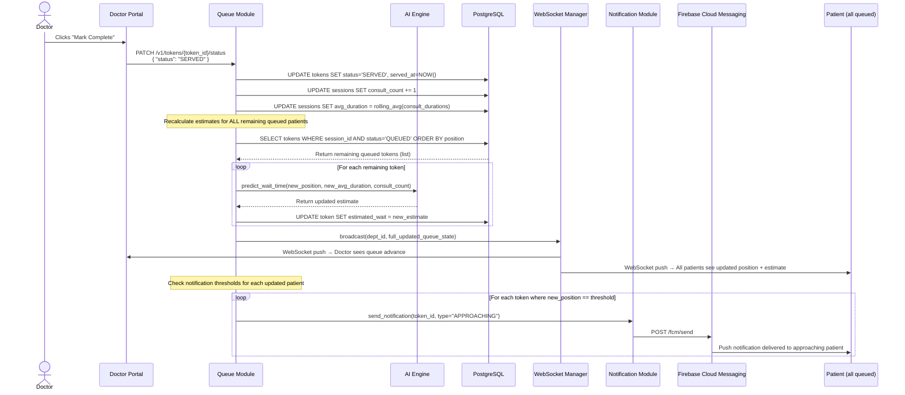

### 8.3 Admin Queue Override Flow

This sequence shows how an administrator remotely pauses a department queue, notifying all active patients.

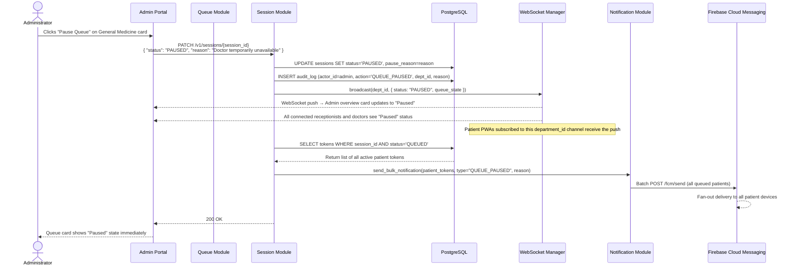

---

## 9. Authentication Flow

QueueCare AI uses Firebase Authentication for identity management. Firebase handles OTP delivery via SMS and issues signed ID tokens (JWTs). The FastAPI backend verifies these tokens using the Firebase Admin SDK — it never stores passwords or generates authentication credentials itself.

### 9.1 Patient Authentication Flow

```mermaid
sequenceDiagram
    actor P as Patient
    participant FE as Patient PWA
    participant FA as Firebase Authentication
    participant API as FastAPI Backend
    participant DB as PostgreSQL

    P->>FE: Enters phone number
    FE->>FA: signInWithPhoneNumber(phone, recaptchaVerifier)
    FA->>P: Sends OTP via SMS
    P->>FE: Enters OTP
    FE->>FA: confirmOTP(verificationCode)
    FA-->>FE: Return Firebase ID token + refresh token
    FE->>FE: Store ID token in memory; refresh token in localStorage

    Note over FE,API: Every API request includes the ID token

    FE->>API: POST /v1/patients/register<br/>Authorization: Bearer {firebase_id_token}
    API->>FA: Verify ID token (Firebase Admin SDK)
    FA-->>API: Decoded token payload { uid, phone_number }
    API->>DB: UPSERT patient WHERE firebase_uid = uid
    DB-->>API: Return patient_id
    API-->>FE: 201 Created | 200 OK with patient profile

    Note over FE: Patient is now authenticated and registered
```

### 9.2 Staff Authentication Flow

Staff accounts are created by the hospital administrator — staff cannot self-register. Staff log in with credentials verified against the QueueCare AI database, then exchange those credentials for a Firebase custom token.

```mermaid
sequenceDiagram
    actor S as Staff Member
    participant FE as Staff Dashboard
    participant API as FastAPI Backend
    participant DB as PostgreSQL
    participant FA as Firebase Authentication

    S->>FE: Enters email/phone + password
    FE->>API: POST /v1/auth/staff/login<br/>{ phone, password }
    API->>DB: SELECT staff WHERE phone = ? AND is_active = true
    DB-->>API: Return staff record with hashed password
    API->>API: Verify bcrypt hash
    alt Credentials valid
        API->>FA: createCustomToken(staff_uid, { role, hospital_id, dept_ids })
        FA-->>API: Return signed custom token
        API-->>FE: 200 OK { custom_token, staff_profile }
        FE->>FA: signInWithCustomToken(custom_token)
        FA-->>FE: Return Firebase ID token + refresh token
        FE->>FE: Store ID token; attach to all API requests
    else Credentials invalid
        API->>DB: Increment failed_login_count
        API-->>FE: 401 INVALID_CREDENTIALS
        Note over API: After 5 failures: 423 ACCOUNT_LOCKED
    end
```

### 9.3 Request Authentication Middleware

Every protected API endpoint in FastAPI passes through the authentication middleware before the route handler is invoked.

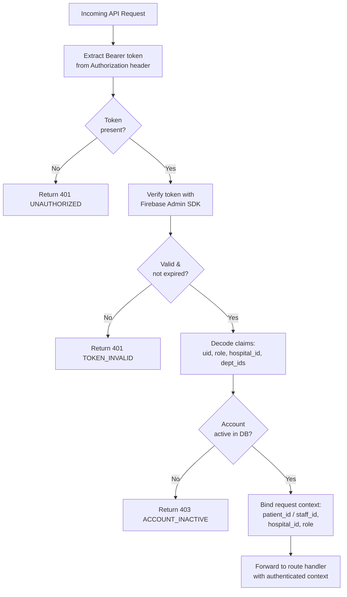

### 9.4 Token Refresh

- Firebase ID tokens expire after 1 hour
- The Firebase SDK automatically refreshes tokens using the stored refresh token before expiry
- The FastAPI backend does not need to handle token refresh — it only validates the current ID token on each request
- Staff sessions expire after 8 hours of inactivity — enforced by clearing the client-side token and blocking new requests until re-authentication

### 9.5 Role-Based Access Control

Roles and permissions are embedded in the Firebase custom token claims for staff, and derived from the patient registration record for patients.

| Claim | Who Carries It | Value |
|-------|---------------|-------|
| `role` | Staff custom token | `receptionist` / `doctor` / `admin` |
| `hospital_id` | Staff custom token | UUID of the staff member's hospital |
| `dept_ids` | Staff custom token | Array of department UUIDs the staff member is assigned to |
| `patient_id` | Patient ID token + DB lookup | UUID of the patient record |

The backend middleware injects these values into the request context. Every database query and route handler uses `hospital_id` from the context to scope all data access — never from a request parameter directly.

---

## 10. Module Interaction

This diagram shows how the internal modules of the FastAPI backend interact with each other and with external services. Arrows indicate the direction of invocation.

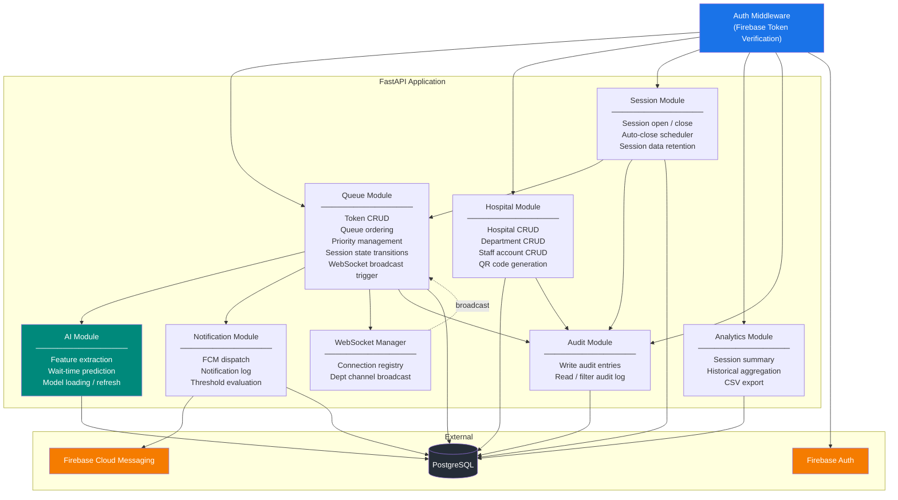

### 10.1 Key Module Interaction Rules

| Rule | Rationale |
|------|-----------|
| **Only the Queue Module triggers WebSocket broadcasts** | Centralises real-time update logic; prevents multiple modules from independently broadcasting inconsistent state |
| **Only the Notification Module sends FCM messages** | Single point of control for notification delivery; makes it easy to add notification logging, rate limiting, or preference checking |
| **Only the Audit Module writes audit log entries** | Prevents duplicated or missing audit entries; all write operations pass through a single interface |
| **The AI Module has no knowledge of queue state transitions** | The AI Module is a pure function: given features, return a prediction. It does not read queue state or trigger side effects. |
| **The Auth Middleware never contains business logic** | Verification only. Role-based access decisions belong in the route handlers and data access layer, not in the middleware. |
| **The Session Module owns session lifecycle** | Queue Module does not directly set session statuses — it calls Session Module functions. This keeps session state management in one place. |

---

## 11. Deployment Architecture

### 11.1 Deployment Overview

QueueCare AI uses a containerised deployment model. The backend is packaged as a Docker container and deployed on a cloud platform. The frontend is a static build deployed to a CDN. The database is a managed PostgreSQL service — no self-hosted database management is required.

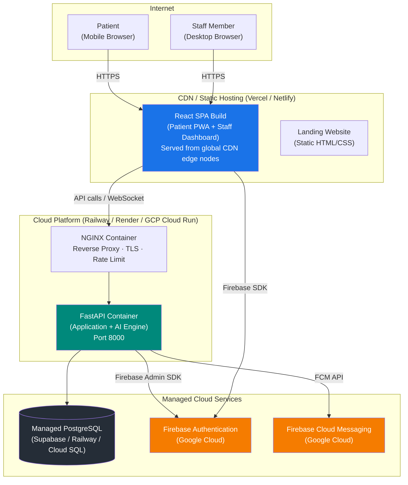

### 11.2 Containerisation

**Backend — Docker container:**

The FastAPI application is packaged in a single Docker image. The image includes:
- Python 3.11 runtime
- FastAPI, Uvicorn (ASGI server), and all Python dependencies
- scikit-learn and the serialised prediction model (`model.joblib`)
- Firebase Admin SDK
- Application source code

The container is stateless — it holds no session state, no queue state in memory (queue state lives in PostgreSQL). This makes horizontal scaling trivial: add more container instances and they all read/write the same database.

**NGINX — Reverse proxy container:**

NGINX sits in front of the FastAPI container and handles:
- TLS termination (HTTPS → HTTP internally)
- HTTP/2 for improved browser connection efficiency
- Rate limiting (configurable requests per minute per IP)
- CORS headers for allowed frontend origins
- WebSocket upgrade proxying (`Upgrade: websocket` header forwarding)
- Static file serving for the Swagger UI documentation

### 11.3 Environment Strategy

Three environments are maintained:

| Environment | Purpose | Database | Backend | Frontend |
|-------------|---------|----------|---------|---------|
| **Development** | Local developer environment | Local PostgreSQL (Docker Compose) | `uvicorn --reload` | `vite dev` |
| **Staging** | Integration testing, demo preparation | Managed cloud PostgreSQL (separate DB instance) | Cloud container (Railway/Render) | CDN deploy (preview URL) |
| **Production** | Live hospital operations (post-approval) | Managed cloud PostgreSQL (production instance) | Cloud container (autoscaled) | CDN deploy (production domain) |

Environment-specific configuration is managed via environment variables — no secrets are hardcoded. A `.env` file is used locally; environment variables are injected by the cloud platform in staging and production.

**Critical environment variables:**

| Variable | Description |
|----------|-------------|
| `DATABASE_URL` | PostgreSQL connection string |
| `FIREBASE_PROJECT_ID` | Firebase project identifier |
| `FIREBASE_PRIVATE_KEY` | Firebase Admin SDK service account key |
| `FCM_SERVER_KEY` | FCM server key for notification dispatch |
| `SECRET_KEY` | Application-level secret for any additional signing |
| `ALLOWED_ORIGINS` | CORS whitelist for frontend domains |
| `ENV` | `development` / `staging` / `production` |

### 11.4 Database Migration Strategy

Database schema changes are managed using **Alembic** (SQLAlchemy's migration tool):
- Every schema change is a versioned migration script
- Migrations run automatically on container startup via an entrypoint command
- Rollback scripts are written alongside every migration
- No destructive migrations (column drops, data truncations) are permitted in production without explicit approval and backup

### 11.5 CI/CD Pipeline (Planned)

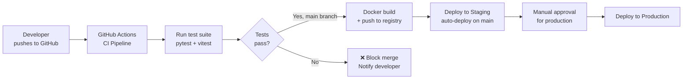

---

## 12. Third-Party Integrations

### 12.1 Firebase Authentication

| Attribute | Detail |
|-----------|--------|
| **Provider** | Google Firebase (google.com/firebase) |
| **Plan** | Spark (free tier) — 10,000 SMS OTP/month; sufficient for MVP |
| **Used for** | OTP delivery via SMS to patients; custom token issuance for staff |
| **SDK (Frontend)** | `firebase` JS SDK v10 — `signInWithPhoneNumber`, `signInWithCustomToken` |
| **SDK (Backend)** | `firebase-admin` Python SDK — `verify_id_token`, `create_custom_token` |
| **Why Firebase Auth** | Eliminates the need to build and maintain SMS OTP infrastructure; handles token lifecycle, revocation, and refresh |
| **Data shared** | Phone number (patient registration); staff UID (custom token subject) |
| **Privacy consideration** | Firebase Auth stores phone numbers in Google's infrastructure. The privacy notice informs patients of this. No medical data is shared. |
| **Failure handling** | If Firebase Auth is unavailable, all authentication requests fail. API returns 503 with a user-friendly message. No workaround is possible — authentication is a hard dependency. |

### 12.2 Firebase Cloud Messaging (FCM)

| Attribute | Detail |
|-----------|--------|
| **Provider** | Google Firebase Cloud Messaging (firebase.google.com/products/cloud-messaging) |
| **Plan** | Free tier — no message limit for downstream (server-to-device) messages |
| **Used for** | Push notification delivery to patient mobile browsers and native apps |
| **SDK (Frontend)** | `firebase` JS SDK — `getToken` (obtains FCM device token), `onMessage` (foreground handling) |
| **SDK (Backend)** | `firebase-admin` Python SDK — `messaging.send()` for individual and batch messages |
| **Why FCM** | Cross-platform (Android, iOS, Web) push delivery without building own push infrastructure; free tier covers MVP volume |
| **Failure handling** | Fire-and-forget; delivery failures are logged but do not block queue operations. Patients can still track position on-screen. |
| **Device token management** | FCM tokens are stored per patient in PostgreSQL. Token refresh is handled by the Firebase SDK and updated via a background sync API call. |

### 12.3 Integration Failure Isolation

Both Firebase integrations are treated as external dependencies that can fail independently of the core queue operations. The following failure isolation rules apply:

| Integration | If it fails | System behaviour |
|-------------|------------|----------------|
| Firebase Auth | Patient/staff cannot log in or make authenticated requests | 503 returned to client; existing sessions continue until token expiry |
| FCM notification delivery | Individual or batch notification not delivered | Failure is logged; queue state continues advancing; patient can still see live position on screen |
| FCM token registration | Patient's device not registered for push | Patient receives no push notifications; on-screen live updates still function via WebSocket |

---

## 13. Scalability Strategy

### 13.1 Current Capacity Targets (MVP)

| Metric | Target |
|--------|--------|
| Concurrent patients (platform-wide) | 500 |
| Concurrent staff users per hospital | 200 |
| Hospitals on platform | Up to 20 |
| Departments per hospital | Up to 20 |
| Tokens per session per department | Up to 200 |
| API response time (p95) | < 3 seconds |
| WebSocket update latency (p95) | < 5 seconds |

### 13.2 Horizontal Scaling — Backend

The FastAPI application is stateless by design. No session state, no queue state, and no user state is stored in memory within the application process. All state lives in PostgreSQL.

This means the backend can be scaled horizontally — multiple container instances can serve requests concurrently — without any application changes:

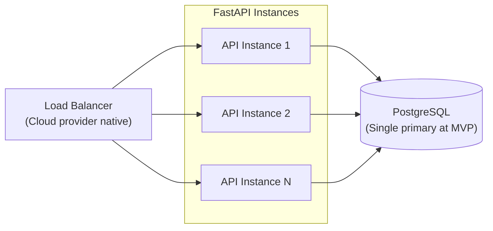

**WebSocket consideration with horizontal scaling:**
When multiple backend instances are running, a WebSocket connection from a patient on Instance 1 cannot directly receive a broadcast from Instance 2. This is the WebSocket fan-out problem.

**MVP solution:** At MVP scale (< 20 hospitals, < 500 concurrent patients), a single backend instance handles all WebSocket connections. Load balancing uses sticky sessions (session affinity) so all connections from the same IP route to the same instance.

**Post-MVP solution (Section 18):** Introduce Redis Pub/Sub as a message broker. Each instance subscribes to department channels in Redis. When any instance broadcasts a queue update, all instances receive it and deliver it to their connected WebSocket clients.

### 13.3 Database Scaling

At MVP scale, a single PostgreSQL primary instance is sufficient. The following strategies are available for scaling if needed:

| Strategy | When to Apply | Method |
|----------|--------------|--------|
| **Read replicas** | Analytics queries slow down write performance | Route all read-only queries (analytics, audit log reads) to a read replica |
| **Connection pooling** | High concurrency exhausts PostgreSQL connections | Add PgBouncer in front of PostgreSQL; reuse connections across container instances |
| **Table partitioning** | `tokens` and `audit_log` tables grow very large | Partition by `session_date` — old data stays queryable but in separate physical storage |
| **Archival** | Session data older than 90 days | Scheduled job archives to cold storage; removes rows from hot tables |

### 13.4 CDN and Frontend Scaling

The React SPA is a static build. It scales infinitely — CDN edge nodes serve it to any number of users simultaneously with no backend involvement. Frontend performance is never a bottleneck in this architecture.

---

## 14. Performance Considerations

### 14.1 Database Query Optimisation

| Index | Table | Purpose |
|-------|-------|---------|
| `idx_tokens_session_status` | `tokens(session_id, status)` | Fast queue depth queries and active queue fetches |
| `idx_tokens_patient` | `tokens(patient_id, status)` | Fast "does patient have active token?" lookup |
| `idx_sessions_dept_date` | `sessions(department_id, session_date)` | Fast "find today's open session" lookup |
| `idx_audit_hospital_time` | `audit_log(hospital_id, created_at DESC)` | Fast audit log pagination per hospital |
| `idx_staff_hospital` | `staff_accounts(hospital_id, is_active)` | Fast staff list per hospital |

The most performance-critical query in the system is the **token issuance transaction** — it must:
1. Check session existence and status
2. Count active queue depth against max capacity
3. Select the next sequential token number
4. Insert the new token record

All four operations are wrapped in a single database transaction using `SELECT ... FOR UPDATE` on the session row to prevent race conditions under concurrent token issuance.

### 14.2 Real-Time Update Performance

The WebSocket broadcast path is the latency-critical path for the 5-second queue update target.

| Step | Expected Latency |
|------|----------------|
| Token status update (POST/PATCH) received by API | < 5ms |
| Database write | 5–30ms |
| AI estimate recalculation (in-process) | < 1ms |
| WebSocket broadcast to all subscribers | 1–10ms |
| Browser render update | 16ms (1 frame at 60fps) |
| **Total end-to-end** | **< 60ms** under normal conditions |

This is well within the 5-second target. The 5-second budget accommodates network latency variability (especially on mobile networks), not compute time.

### 14.3 API Response Time Optimisation

| Technique | Applied To | Expected Improvement |
|-----------|-----------|---------------------|
| **Async database queries** | All FastAPI route handlers | Non-blocking I/O; single-threaded event loop handles many requests concurrently |
| **Pydantic v2 validation** | All request/response models | 5–10× faster serialisation vs Pydantic v1 |
| **Database connection pool** | SQLAlchemy async engine | Reuses connections; eliminates TCP handshake overhead per request |
| **Indexed foreign key joins** | Analytics aggregation queries | Aggregations over large `tokens` tables complete in < 500ms |
| **Eager loading** | Queue list fetch | Fetch token + patient name in single JOIN query; no N+1 problem |
| **HTTP/2** | NGINX → Browser | Multiplexed requests; reduced connection overhead for the SPA loading multiple assets |

### 14.4 Frontend Performance

| Technique | Implementation |
|-----------|---------------|
| **Code splitting** | React Router lazy loading — each route is a separate bundle; initial load only downloads the current screen |
| **CDN delivery** | All static assets (JS, CSS, fonts) served from CDN edge nodes with aggressive cache headers |
| **Service worker caching** | Patient PWA caches app shell; subsequent visits load from cache in < 1 second |
| **Debounced search** | Patient search fires after 300ms of inactivity — prevents a database query on every keystroke |
| **Optimistic UI** | Token status changes (Served, No-Show) update the UI immediately before the API confirms — corrects if the request fails |

---

## 15. Security Overview

### 15.1 Authentication and Authorisation Security

| Control | Implementation |
|---------|---------------|
| **Token verification** | Every API request verifies the Firebase ID token signature using Firebase Admin SDK; tokens cannot be forged without Google's private key |
| **Token expiry** | Firebase ID tokens expire after 1 hour; refresh tokens are rotated on use |
| **Account lockout** | Staff accounts locked after 5 consecutive failed login attempts; requires password reset via verified phone to unlock |
| **Role enforcement** | RBAC claims in Firebase custom token; every route handler checks role before executing business logic |
| **hospital_id scoping** | Every data access function in the backend accepts a `hospital_id` from the auth context, never from user-supplied parameters; cross-hospital access is architecturally impossible through normal API paths |
| **Session expiry** | Staff sessions expire after 8 hours of inactivity; patient sessions expire after 24 hours |

### 15.2 Transport Security

| Control | Implementation |
|---------|---------------|
| **TLS everywhere** | All browser-to-server communication uses HTTPS (TLS 1.2+); enforced by NGINX; HTTP requests are redirected to HTTPS |
| **WebSocket security** | WebSocket connections use `wss://` (WebSocket Secure); TLS termination at NGINX |
| **HSTS** | HTTP Strict Transport Security header set by NGINX; browsers remember HTTPS-only for the domain |
| **CORS** | NGINX and FastAPI enforce a strict CORS allowlist — only the configured frontend origin(s) may call the API |

### 15.3 Data Security

| Control | Implementation |
|---------|---------------|
| **Password hashing** | Staff passwords hashed with `bcrypt` (cost factor 12); never stored in plaintext |
| **PII minimisation** | Only name, phone number, age, and gender stored per patient; no clinical data collected at any point |
| **No PII in notifications** | FCM notification payloads contain only token number, department name, and a directive — never personal details or health information |
| **No PII in analytics** | Analytics API responses and CSV exports contain only aggregate metrics; patient names are included in per-token exports but phone numbers, ages, and genders are excluded |
| **Audit log immutability** | Audit log rows have no `UPDATE` or `DELETE` permissions granted to the application database user; only `INSERT` and `SELECT` are permitted |
| **Data retention** | Automated scheduled job anonymises patient identifiers on tokens older than 90 days by replacing `patient_id` foreign key with a null/tombstone value |

### 15.4 Infrastructure Security

| Control | Implementation |
|---------|---------------|
| **Secrets management** | No secrets in source code; environment variables injected by cloud platform at runtime |
| **Docker image security** | Base image is `python:3.11-slim`; no root user in container; read-only filesystem where possible |
| **Rate limiting** | NGINX enforces request rate limits per IP address — prevents brute-force login attacks and API abuse |
| **SQL injection prevention** | All database queries use SQLAlchemy parameterised queries; no raw string concatenation in queries |
| **Input validation** | All API request bodies validated by Pydantic v2 models before reaching business logic; malformed inputs are rejected with a 422 error before any database access |
| **Dependency scanning** | `pip-audit` runs in CI pipeline to detect known vulnerabilities in Python dependencies |

### 15.5 Multi-Tenant Security Model

The multi-tenant isolation model is a defence-in-depth approach with three independent layers:

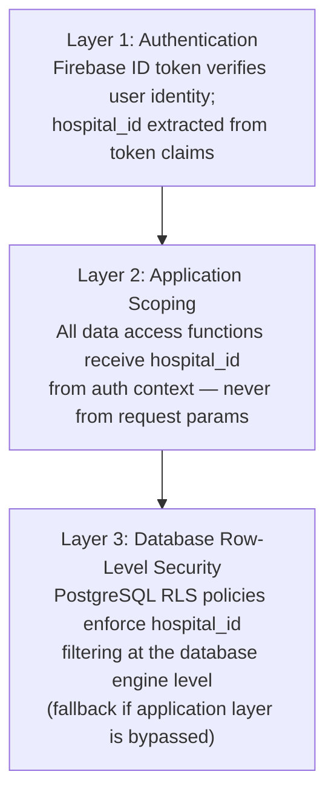

An attacker who bypasses Firebase token verification (Layer 1) would still need to bypass application-level scoping (Layer 2). An attacker who bypasses both would still be blocked by PostgreSQL RLS (Layer 3).

---

## 16. Error Handling Strategy

### 16.1 Error Handling Philosophy

Every layer of the architecture has a defined error handling responsibility. Errors do not propagate silently — every failure is caught, classified, logged, and communicated to the appropriate consumer (user, developer, or operations team) in a form appropriate to that consumer.

The three audiences for error information are:
- **Users** (patients and staff): Plain-language messages explaining what happened and what to do next — never raw exceptions or error codes
- **Developers**: Structured error responses with machine-readable error codes for programmatic handling
- **Operations**: Structured logs with full context for debugging and alerting

### 16.2 API Error Response Standard

All FastAPI error responses follow a consistent JSON envelope:

```json
{
  "error": {
    "code": "QUEUE_FULL",
    "message": "The queue for this department has reached its maximum capacity. Please try again later.",
    "details": {
      "department_id": "uuid",
      "max_capacity": 80,
      "current_depth": 80
    }
  }
}
```

| Field | Purpose |
|-------|---------|
| `code` | Machine-readable error code — used by the frontend to determine which error screen to show |
| `message` | Human-readable explanation — displayed to the user (with localisation where applicable) |
| `details` | Additional context for debugging — not displayed to the user |

### 16.3 Error Code Registry

| HTTP Status | Error Code | Trigger |
|-------------|-----------|---------|
| 400 | `INVALID_REQUEST` | Malformed request body; validation failure |
| 400 | `SESSION_NOT_OPEN` | Attempt to issue token when no active session exists |
| 401 | `UNAUTHORIZED` | Missing or expired Firebase ID token |
| 401 | `TOKEN_INVALID` | Firebase token verification failed |
| 401 | `INVALID_CREDENTIALS` | Incorrect staff login credentials |
| 403 | `FORBIDDEN` | Authenticated but lacks permission (wrong role, wrong hospital) |
| 403 | `ACCOUNT_INACTIVE` | Staff account has been deactivated |
| 404 | `NOT_FOUND` | Resource does not exist |
| 409 | `QUEUE_FULL` | Queue has reached maximum capacity |
| 409 | `DUPLICATE_TOKEN` | Patient already holds an active token for this department |
| 409 | `QUEUE_PAUSED` | Queue is currently paused |
| 409 | `QUEUE_CLOSED` | Queue is closed for the day |
| 423 | `ACCOUNT_LOCKED` | Staff account locked after 5 failed login attempts |
| 500 | `INTERNAL_ERROR` | Unhandled exception; database error; unexpected condition |
| 503 | `SERVICE_UNAVAILABLE` | External service (Firebase Auth, FCM) unavailable |

### 16.4 Layer-Specific Error Handling

**Frontend (React):**
- Global error boundary catches unhandled React render errors; shows a generic error screen
- API call failures are handled per-request with specific error screen states per error code
- WebSocket disconnections trigger an automatic reconnect with exponential backoff (1s, 2s, 4s, 8s, max 30s)
- Network loss detected via browser `navigator.onLine` and `offline` event; shows connectivity warning

**NGINX:**
- 502/504 from upstream FastAPI → returns a custom JSON error response (not default NGINX HTML)
- Rate limit exceeded → 429 Too Many Requests with `Retry-After` header

**FastAPI application:**
- Pydantic validation errors → caught globally, formatted as `INVALID_REQUEST` 400
- Database integrity errors → caught by data access layer, converted to appropriate 409 or 500
- Firebase Admin SDK errors → caught in auth middleware, converted to 401/503 as appropriate
- Unhandled exceptions → caught by global exception handler; structured 500 response; full stack trace written to logs (never exposed to client)

**Database:**
- Unique constraint violations → caught and converted to `DUPLICATE_TOKEN` or similar 409 responses
- Connection pool exhaustion → caught; 503 returned; alert triggered
- Transaction deadlock → automatic retry (up to 3 attempts) before returning 500

### 16.5 Queue Operation Resilience

Queue state changes must be atomic and resilient. The following guarantees are enforced:

| Operation | Resilience Measure |
|-----------|------------------|
| Token issuance | Wrapped in a database transaction; concurrent requests cannot issue the same token number |
| Token status update | Idempotent — calling `PATCH status=SERVED` on an already-served token returns 200 with the current state, not an error |
| WebSocket broadcast failure | Caught silently; queue state change in DB is committed regardless of broadcast success |
| FCM send failure | Logged as a failed notification; does not roll back queue state change |
| AI prediction failure | Returns `null` estimate; queue join proceeds normally; cold-start message shown to patient |

---

## 17. Logging and Monitoring

### 17.1 Logging Architecture

QueueCare AI uses **structured logging** throughout. All log entries are JSON objects — not plain text strings. Structured logs are machine-readable, making it straightforward to search, filter, and alert on specific events.

**Log levels:**

| Level | Usage |
|-------|-------|
| `DEBUG` | Development and staging only — detailed internal state; never enabled in production |
| `INFO` | Normal operation — request received, token issued, session opened |
| `WARNING` | Recoverable issue — FCM delivery failure, prediction cold-start, rate limit approached |
| `ERROR` | Unhandled exception, database error, authentication failure requiring investigation |
| `CRITICAL` | Database unreachable, service startup failure — requires immediate response |

**Standard log fields in every entry:**

| Field | Description |
|-------|-------------|
| `timestamp` | ISO 8601 UTC timestamp |
| `level` | Log level |
| `service` | `queuecare-api` |
| `trace_id` | UUID generated per request, included in response header (`X-Trace-ID`) |
| `hospital_id` | Hospital context (from authenticated request) |
| `user_id` | Patient or staff ID (from authenticated request) |
| `module` | Module name (e.g., `queue`, `notification`, `auth`) |
| `event` | Machine-readable event name (e.g., `token.issued`, `notification.failed`) |
| `message` | Human-readable log message |
| `details` | Contextual data (token_id, dept_id, error details etc.) |
| `duration_ms` | Request processing duration (INFO level on all API requests) |

### 17.2 Key Events Logged

| Event | Level | Logged Fields |
|-------|-------|-------------|
| API request received | INFO | method, path, status_code, duration_ms, trace_id |
| Token issued | INFO | token_id, token_number, patient_id, dept_id, position, estimate |
| Token status changed | INFO | token_id, from_status, to_status, actor_id, actor_role |
| Queue paused / resumed / closed | INFO | session_id, dept_id, actor_id, reason |
| Priority assigned | INFO | token_id, priority_category, actor_id |
| Notification sent | INFO | notification_id, type, patient_id, fcm_status |
| Notification delivery failed | WARNING | notification_id, patient_id, fcm_error |
| Authentication failed | WARNING | reason, ip_address, attempted_uid |
| Account locked | WARNING | staff_id, failed_attempts, locked_at |
| AI prediction cold-start | WARNING | dept_id, session_id, consult_count |
| Database query slow (> 1s) | WARNING | query_name, duration_ms |
| Unhandled exception | ERROR | exception_type, stack_trace, trace_id |
| Database connection failed | CRITICAL | host, error, retry_count |

### 17.3 Monitoring and Alerting

At MVP, monitoring uses a combination of cloud platform metrics and application-level health checks.

**Health check endpoint:**
`GET /health` returns:
```json
{
  "status": "healthy",
  "database": "connected",
  "timestamp": "2026-08-01T09:00:00Z"
}
```

Returns `503` if the database is unreachable. Used by the cloud platform's load balancer health checks to determine if a container instance should receive traffic.

**Key metrics to monitor:**

| Metric | Tool | Alert Threshold |
|--------|------|----------------|
| API error rate (5xx) | Cloud platform metrics | > 1% of requests in 5-minute window |
| API p95 response time | Cloud platform metrics | > 3 seconds sustained for 2 minutes |
| WebSocket connection count | Application metric (logged) | Alert if > 0 connections with no active sessions |
| Database connection pool utilisation | SQLAlchemy pool stats | > 80% pool utilisation |
| FCM delivery failure rate | Application log analysis | > 5% failures in 10-minute window |
| Container CPU utilisation | Cloud platform metrics | > 80% sustained for 5 minutes |
| Container memory utilisation | Cloud platform metrics | > 85% |

**Observability tooling (MVP):**
- **Log aggregation:** Cloud platform native log viewer (Railway / GCP Cloud Logging)
- **Uptime monitoring:** UptimeRobot or Better Uptime (free tier) — monitors `/health` endpoint every 60 seconds
- **Error tracking:** Sentry (free tier) — captures unhandled exceptions with full stack traces and context

---

## 18. Future Scalability

This section defines the architectural evolution path as QueueCare AI grows from a prototype to a production platform serving 50+ hospitals.

### 18.1 Phase 2 — Redis for Real-Time Pub/Sub

**Trigger:** When the platform requires multiple backend instances running simultaneously (> 20 hospitals or > 1000 concurrent patients).

**Change:** Replace the in-process WebSocket Manager with a Redis Pub/Sub-backed broadcast system.

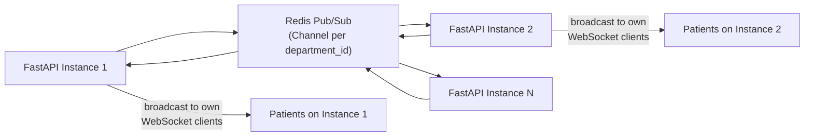

When any instance writes a queue update to Redis on the relevant channel, all instances receive it and deliver it to their own connected WebSocket clients. This eliminates the sticky session requirement.

**Impact on existing code:** Only the WebSocket Manager module changes. All other modules are unaffected.

### 18.2 Phase 2 — ML Model Serving Service

**Trigger:** When the AI model becomes a Random Forest or gradient boosting model trained on real production data (> 5,000 sessions). The model grows from <1MB to potentially 50–200MB, making in-process loading expensive.

**Change:** Extract the AI Engine into a standalone FastAPI microservice:
- Dedicated `/predict` endpoint accepting feature vectors
- Model loaded once on startup; served from memory
- FastAPI backend calls this internal service via HTTP
- Enables independent model deployment without redeploying the main application

### 18.3 Phase 3 — Database Read Replicas

**Trigger:** Analytics queries on the PostgreSQL primary begin affecting write throughput for active queues.

**Change:**
- Provision a PostgreSQL read replica
- Route all analytics module queries to the read replica
- All write operations and live queue queries remain on the primary

Implementation: SQLAlchemy session factory is updated to use a separate connection pool for read-only queries based on a configuration flag.

### 18.4 Phase 3 — Background Task Queue

**Trigger:** Bulk notification sending (e.g., notifying 200 patients simultaneously on queue pause) blocks the API event loop for measurable time.

**Change:** Introduce Celery with Redis as the task broker:
- Notification tasks dispatched to the Celery worker queue
- API returns immediately; workers process notifications asynchronously
- Celery Beat handles scheduled tasks (auto-close sessions, data archival, model retraining)

### 18.5 Phase 4 — Microservices Extraction

When individual modules become large enough to benefit from independent scaling and deployment:

| Module to Extract | Reason |
|------------------|--------|
| Notification Service | Independent scaling for high-volume notification periods; FCM rate limit management |
| Analytics Service | Separate scaling from transactional queue operations; long-running query isolation |
| AI Service | Already addressed in Phase 2; large model support |
| Patient Identity Service | When ABDM/ABHA integration requires a dedicated identity management domain |

The modular monolith architecture in v1 is specifically designed to make this extraction feasible — each module has clean boundaries, no circular dependencies, and well-defined interfaces.

---

## 19. Architecture Decision Summary

This section documents all significant architecture decisions as Architecture Decision Records (ADRs). Each ADR captures the context, decision, rationale, and consequences of a major technical choice.

| ADR | Decision | Alternatives Considered | Rationale | Consequences |
|-----|---------|------------------------|-----------|-------------|
| **ADR-01** | **Modular Monolith over Microservices** | Microservices (separate services per module) | Single developer; scikit-learn runs in-process; no inter-service network overhead; faster to build and debug; clean module boundaries allow future extraction | Single deployment unit; horizontal scaling requires sticky sessions for WebSocket at MVP; modules cannot be scaled independently until extracted (Phase 4) |
| **ADR-02** | **FastAPI (Python) for backend** | Node.js/Express, Django, Flask | Native async I/O for WebSocket handling; first-class scikit-learn integration; Pydantic v2 for fast validation; automatic OpenAPI docs; Python async performance comparable to Node.js for I/O-bound workloads | Python GIL limits CPU-bound parallelism; resolved by Uvicorn worker model; scikit-learn inference is microseconds so GIL contention is negligible |
| **ADR-03** | **React (Vite) for all frontend surfaces** | Vue.js, Svelte, Next.js | Largest ecosystem for healthcare SaaS; strong WebSocket libraries; component reuse across patient PWA and staff dashboards; Vite provides fast development experience; single language (TypeScript/JavaScript) across all frontend surfaces | Client-side rendering only (no SSR at MVP); initial page load requires JS bundle download; mitigated by CDN delivery and service worker caching for patient PWA |
| **ADR-04** | **Progressive Web App (PWA) for patient interface** | Native Android/iOS app | No App Store approval required; hospitals can display a URL instead of an app; QR code scanning via browser camera API; patients use without installation; works on any modern smartphone | Limited background notification support compared to native apps; relies on browser notification permission grant; web push less reliable on iOS Safari compared to native (mitigated at MVP by accepting this limitation) |
| **ADR-05** | **PostgreSQL for database** | MongoDB, MySQL, Firebase Firestore | ACID transactions essential for token issuance concurrency; relational model fits queue domain perfectly; window functions for analytics; Row-Level Security for multi-tenancy; strong indexing support | Schema migrations required for structural changes; more complex setup than Firestore for a single developer; mitigated by Alembic and managed cloud PostgreSQL |
| **ADR-06** | **Firebase Authentication for OTP** | Custom SMS OTP (Twilio/MSG91), Supabase Auth | Eliminates custom OTP infrastructure; handles token lifecycle, rotation, and revocation; free tier covers MVP volume; Firebase Admin SDK provides server-side verification | Dependency on Google infrastructure; phone number stored in Firebase; patient privacy notice required; SMS OTP subject to Firebase quota limits (10,000/month on free tier) |
| **ADR-07** | **Firebase Cloud Messaging for push notifications** | OneSignal, AWS SNS, custom APNs/FCM direct | Cross-platform (Android, iOS, Web) with single API; free tier; Firebase SDK handles device token lifecycle; integrates with Firebase Auth project | Requires patient device notification permission grant; web push unreliable on some iOS versions; notification delivery not guaranteed (fire-and-forget is the correct pattern — queue state on screen is always the source of truth) |
| **ADR-08** | **WebSockets for real-time queue updates** | Long polling, Server-Sent Events (SSE) | 5-second update latency target; bidirectional (needed for call/complete actions from doctor dashboard); lower overhead than polling for 500 concurrent connections; channel-per-department model is clean and scalable | Requires sticky sessions when multiple backend instances run; resolved at MVP scale with single instance; Phase 2 adds Redis Pub/Sub for multi-instance support |
| **ADR-09** | **scikit-learn Linear Regression for wait-time prediction (v1)** | Random Forest, XGBoost, custom neural network | Simulated training data at MVP — complex models would overfit; linear regression is interpretable and fast to train; in-process inference < 1ms; joblib serialisation is trivial | Low prediction accuracy variance without real data; acceptable at MVP where estimates are explicitly labelled as approximate; replaced with Random Forest in Phase 2 after real session data accumulates |
| **ADR-10** | **AI Engine in-process (not a separate service)** | Separate FastAPI ML service, MLflow model server | scikit-learn inference is microseconds — no separate service is justified; eliminates network hop, deployment complexity, and failure point; model is < 1MB serialised | Must be refactored when model size grows (Phase 2); in-process model loading adds ~100ms to cold-start time on container launch (acceptable) |
| **ADR-11** | **Shared schema multi-tenancy (tenant discriminator)** | Database-per-tenant, schema-per-tenant | Simplest to implement and maintain at MVP scale (< 20 hospitals); single migration applies to all tenants; lowest operational overhead for a single developer | Cross-tenant data leakage is possible if hospital_id scoping is improperly implemented; mitigated by application-level scoping + PostgreSQL RLS as defence-in-depth; schema-per-tenant migration planned for Phase 4 at enterprise scale |
| **ADR-12** | **Fire-and-forget for push notifications** | Synchronous notification with acknowledgement retry | Notification delivery must not block or delay queue operations; a failed notification should never prevent a token from advancing; patients have the on-screen queue view as the authoritative source of truth | Delivery failures are logged but not automatically retried at MVP; the patient may miss a notification in edge cases but the live screen always shows current state |
| **ADR-13** | **Docker + managed cloud for deployment** | Self-hosted VPS, Kubernetes (K8s), serverless (AWS Lambda) | Docker provides portability and reproducibility; managed cloud (Railway/Render) eliminates infrastructure management for a single developer; K8s is operationally complex for MVP; serverless has WebSocket limitations | Cold-start latency on container spin-up (mitigated by keeping one always-warm instance); cost scales with usage (acceptable at MVP volume); can migrate to K8s in Phase 4 if needed |
| **ADR-14** | **NGINX as reverse proxy** | Traefik, Caddy, cloud load balancer only | Proven, well-documented; handles TLS termination, CORS, rate limiting, WebSocket upgrade, and HTTP/2 in one component; no additional cloud load balancer cost at MVP | Adds one more component to configure and maintain; offset by NGINX's maturity and extensive documentation |

---

## 20. Conclusion

### 20.1 Architecture Summary

QueueCare AI is built on a deliberate stack of modern, mature, and operationally manageable technologies. The architecture reflects the realities of the project: a single developer, a six-month timeline, a focused set of product requirements, and a clear evolution path to production scale.

The core architectural decisions — modular monolith, FastAPI, PostgreSQL, Firebase Auth, FCM, WebSockets, React PWA, and in-process scikit-learn — are not compromises. They are the right choices for the problem at hand, at this stage. They are also the right foundation for the next stage: the module boundaries are clean, the data model is relational and scalable, and the evolution path to Redis, microservices, and ML serving is clearly defined.

### 20.2 How the Architecture Meets the Goals

| Architecture Goal | How It Is Met |
|------------------|--------------|
| AG-01: Real-time queue state < 5 seconds | WebSocket channel-per-department broadcast; total end-to-end latency budget < 60ms under normal conditions |
| AG-02: Sub-3-second API responses | FastAPI async I/O; database connection pooling; indexed queries; Pydantic v2 serialisation |
| AG-03: 99% uptime during operating hours | Containerised stateless deployment; cloud platform SLA; health check endpoint for load balancer; database on managed service with built-in replication |
| AG-04: Multi-tenant data isolation | Three-layer defence: Firebase token hospital_id claim → application-level scoping → PostgreSQL Row-Level Security |
| AG-05: Horizontal scalability | Stateless FastAPI containers; sticky sessions for WebSocket at MVP; Phase 2 Redis Pub/Sub removes this constraint |
| AG-06: Minimal operational overhead | Managed cloud PostgreSQL; Firebase Auth (no OTP infrastructure); FCM (no push infrastructure); Docker on managed platform |
| AG-07: AI integrated in same codebase | scikit-learn in-process; < 1ms inference; < 1MB serialised model; no separate service required at MVP |
| AG-08: Mobile-first patient experience via PWA | React PWA with service worker; browser QR scanning; no app store; works on any modern smartphone |

### 20.3 What This Architecture Does Not Cover

| Topic | Addressed In |
|-------|-------------|
| Database schema and entity definitions | Data Model Document (planned — `11_Data_Model.md`) |
| API endpoint specifications | API Design Document (planned — `12_API_Design.md`) |
| UI component specifications | `09_UI_UX_Design.md` |
| Test strategy and test coverage | Test Plan Document (planned) |
| ABDM/ABHA integration architecture | Future Architecture Extension (Phase 2) |

### 20.4 Final Statement

This architecture is complete, justified, and ready for implementation. Every major decision has a documented rationale. Every component has a clearly defined responsibility. Every evolution path — from MVP to enterprise scale — is specified. The system can be built by a single developer in six months, demonstrated as a functioning prototype, and extended into a production-grade platform serving Indian hospitals without architectural rework.

---

## Document History

| Version | Date | Author | Changes |
|---------|------|--------|---------|
| 1.0 (Draft) | 2026-08-01 | Ram Chauhan | Initial document — all 20 sections complete |

---

*Pending approval. Next document in sequence: `11_Data_Model.md`*
