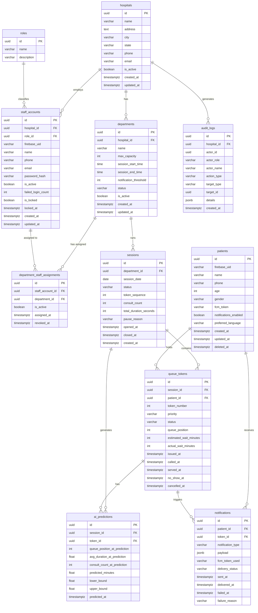

# QueueCare AI — Database Design Document

**Product:** QueueCare AI — AI-Based Smart Hospital Queue Management and Wait Time Prediction System
**Document ID:** 11
**Version:** 1.0 (Draft)
**Status:** Pending Approval
**Last Updated:** August 1, 2026
**Author:** Ram Chauhan
**Related Documents:** `05_Product_Requirements_Document.md`, `10_System_Architecture.md`

---

## Table of Contents

1. [Introduction](#1-introduction)
2. [Database Design Goals](#2-database-design-goals)
3. [Database Architecture](#3-database-architecture)
4. [Entity Relationship Diagram](#4-entity-relationship-diagram)
5. [Database Schema Overview](#5-database-schema-overview)
6. [Tables](#6-tables)
7. [Relationships Between Tables](#7-relationships-between-tables)
8. [Database Normalization](#8-database-normalization)
9. [Indexing Strategy](#9-indexing-strategy)
10. [Security Considerations](#10-security-considerations)
11. [Backup and Recovery Strategy](#11-backup-and-recovery-strategy)
12. [Future Database Expansion](#12-future-database-expansion)
13. [Conclusion](#13-conclusion)

---

## 1. Introduction

### 1.1 Purpose

This document defines the complete database design for QueueCare AI — an AI-powered hospital queue management and wait-time prediction platform. It serves as the authoritative reference for backend developers, database administrators, and technical reviewers working on data persistence, query design, and data integrity for the system.

This document covers:
- Database technology selection and rationale
- Multi-tenancy architecture and data isolation strategy
- Entity Relationship Diagram (ERD) for all core tables
- Detailed table specifications including columns, data types, constraints, and relationships
- Normalisation analysis
- Indexing strategy for query performance
- Security, access control, and data protection
- Backup, recovery, and data retention strategy
- Future expansion path

This document does not include SQL implementation scripts, API endpoint specifications, or frontend/UI concerns. Those are addressed in separate documents.

### 1.2 Why PostgreSQL

QueueCare AI uses **PostgreSQL 15+** as its primary and only database. The decision is documented in ADR-05 of `10_System_Architecture.md` and is summarised here:

| Requirement | PostgreSQL Capability |
|-------------|----------------------|
| **ACID transactions** for concurrent token issuance | Full ACID with `SELECT ... FOR UPDATE` and serialisable isolation |
| **Relational integrity** for multi-entity queue domain | Foreign keys, referential integrity, cascading operations |
| **Multi-tenant row-level isolation** | Row-Level Security (RLS) policies enforceable at the engine level |
| **Complex analytics queries** | Window functions, CTEs, aggregation, and `JSONB` for flexible metadata |
| **Concurrent queue operations** | Advisory locks, `SELECT ... FOR UPDATE SKIP LOCKED` for queue processing |
| **Scalability** | Read replicas, connection pooling (PgBouncer), partitioning for large tables |
| **Open source and managed hosting** | Available as managed service on Supabase, Railway, Google Cloud SQL — no licensing cost |

### 1.3 Scope

This design covers the complete v1 MVP database schema. All tables required for the following functional areas are specified:
- User identity and role management
- Hospital and department configuration
- Patient registration
- Queue session management
- Queue token lifecycle
- Wait-time predictions
- Push notification logging
- Audit trail
- Staff assignment to departments

---

## 2. Database Design Goals

| ID | Goal | Design Implication |
|----|------|-------------------|
| DG-01 | **Data integrity** — no orphaned records, no invalid state transitions | Foreign key constraints on all relationships; check constraints on status columns |
| DG-02 | **Multi-tenant isolation** — hospital A's data cannot be accessed by hospital B users | `hospital_id` discriminator column on all tenant-scoped tables; PostgreSQL RLS policies as defence-in-depth |
| DG-03 | **Concurrent correctness** — two simultaneous token issuances cannot produce duplicate token numbers | Session-scoped sequence using `SELECT ... FOR UPDATE` on session row; atomic increment |
| DG-04 | **Query performance** — queue list, position lookup, and analytics queries complete in < 500ms | Targeted composite indexes on all high-frequency query patterns |
| DG-05 | **Audit completeness** — every significant queue action has an immutable log entry | `audit_logs` table with INSERT-only permissions; no UPDATE or DELETE on audit rows |
| DG-06 | **Minimal PII storage** — only the minimum patient data required for queue operations | Patient table stores only name, phone, age, gender; no clinical or medical fields |
| DG-07 | **Data retention compliance** — patient-identifiable data removed after 90 days | `queue_tokens.patient_id` set to null after 90-day retention window; patient record anonymised |
| DG-08 | **Schema evolution without downtime** | All schema changes managed via Alembic migrations; additive migrations preferred; destructive changes require explicit approval |
| DG-09 | **Third Normal Form (3NF)** — no update anomalies or transitive dependencies | Every non-key column depends on the primary key, the whole key, and nothing but the key |
| DG-10 | **UUID primary keys** — no sequential integer IDs exposed externally | All primary keys are `UUID` generated by PostgreSQL (`gen_random_uuid()`); prevents enumeration attacks and simplifies data merging across environments |

---

## 3. Database Architecture

### 3.1 Multi-Tenancy Model: Shared Schema with Tenant Discriminator

QueueCare AI uses a **shared schema, tenant discriminator** multi-tenancy model. All hospitals share the same set of tables within a single PostgreSQL database. Every tenant-scoped table includes a `hospital_id` column that links every row to a specific hospital.

```
Single PostgreSQL Database
├── hospitals          (tenant registry — one row per hospital)
├── departments        (hospital_id FK)
├── staff_accounts     (hospital_id FK)
├── sessions           (hospital_id FK via department)
├── queue_tokens       (hospital_id FK via session)
├── audit_logs         (hospital_id FK — direct)
├── notifications      (not tenant-scoped — patient-scoped)
├── patients           (platform-wide — not hospital-scoped)
├── roles              (platform-wide lookup)
└── ai_predictions     (session-scoped)
```

**Rationale for shared schema:**
- Simplest operational model for a single developer managing < 50 hospitals
- Single Alembic migration applies to all tenants simultaneously
- No connection routing overhead
- Straightforward upgrade path to schema-per-tenant in the future

**Isolation enforcement:**
- **Application layer:** Every query is scoped by `hospital_id` derived from the authenticated user's claims — never from user-supplied parameters
- **Database layer:** PostgreSQL Row-Level Security (RLS) policies enforce `hospital_id` filtering as a second layer of defence

### 3.2 Key Design Decisions

| Decision | Choice | Rationale |
|----------|--------|-----------|
| **Primary key type** | `UUID` (v4, `gen_random_uuid()`) | Prevents sequential enumeration; safe to expose in URLs; simplifies merging across environments |
| **Timestamps** | `TIMESTAMPTZ` (UTC) | Timezone-aware; essential for a platform potentially deployed across time zones |
| **Soft deletes** | `is_active BOOLEAN` on `hospitals`, `departments`, `staff_accounts` | Preserves historical data for audit and analytics; hard deletes only for GDPR data deletion requests |
| **Status columns** | `VARCHAR` with `CHECK` constraint on valid values | Human-readable in queries; constrained to prevent invalid states |
| **Metadata flexibility** | `JSONB` for event details in `audit_logs` and notification payloads | Allows extensible schema without migrations for log enrichment |
| **Token numbering** | `token_number INTEGER` scoped to session — reset to 1 each day | Matches operational expectation ("Token 7 in Orthopedics today") |
| **Patient-queue link** | `queue_tokens.patient_id` nullable after 90-day retention | Supports data minimisation without losing queue history aggregate data |
| **Self-referencing avoided** | No recursive foreign keys | Simplifies queries and prevents circular dependency issues |

### 3.3 PostgreSQL-Specific Features Used

| Feature | Usage |
|---------|-------|
| `UUID` with `gen_random_uuid()` | All primary keys |
| `TIMESTAMPTZ` | All timestamp columns |
| `CHECK` constraints | Status enum validation on token status, session status, priority |
| `UNIQUE` constraints | Phone numbers, email addresses, department names per hospital |
| Row-Level Security (RLS) | Multi-tenant data isolation at engine level |
| `JSONB` | Audit log event details, notification payload metadata |
| `SELECT ... FOR UPDATE` | Concurrent token issuance serialisation |
| Partial indexes | `WHERE is_active = true` on frequently filtered queries |
| Composite indexes | Multi-column indexes for common join + filter patterns |
| `NOW()` / `CURRENT_DATE` | Default timestamps; session date assignment |

---
## 4. Entity Relationship Diagram

The following diagram shows all tables and their relationships. Cardinality is annotated on each association.



---
## 5. Database Schema Overview

The QueueCare AI database contains **11 tables** across three logical groupings:

### 5.1 Platform-Level Tables (shared, not hospital-scoped)

| Table | Description | Approximate Row Count |
|-------|-------------|----------------------|
| `roles` | Staff role lookup (Receptionist, Doctor, Admin) | 3–5 rows (static) |
| `patients` | All patients registered platform-wide | ~10,000 in year 1 |

### 5.2 Tenant-Scoped Tables (each row belongs to one hospital)

| Table | Description | Approximate Row Count |
|-------|-------------|----------------------|
| `hospitals` | One row per hospital on the platform | ~20–50 |
| `departments` | OPD departments within hospitals | ~200–500 |
| `staff_accounts` | Receptionists, doctors, administrators | ~500–2,000 |
| `department_staff_assignments` | Junction: staff assigned to departments | ~1,000–5,000 |
| `sessions` | Daily OPD sessions per department | ~50,000 per year |
| `queue_tokens` | One row per patient per session join | ~2,000,000 per year |
| `audit_logs` | Every significant queue and admin action | ~10,000,000 per year |

### 5.3 Operational / Transactional Tables

| Table | Description | Approximate Row Count |
|-------|-------------|----------------------|
| `notifications` | Push notification delivery log | ~5,000,000 per year |
| `ai_predictions` | One prediction record per token issue | ~2,000,000 per year |

### 5.4 Table Naming Conventions

- All table names are **lowercase**, **plural**, **snake_case**
- Junction tables are named `{entity_a}_{entity_b}_assignments` or `{entity_a}_{entity_b}`
- All primary key columns are named `id`
- All foreign key columns follow the pattern `{referenced_table_singular}_id`
- Boolean columns use the prefix `is_` (e.g., `is_active`, `is_locked`)
- Timestamp columns use the suffix `_at` (e.g., `created_at`, `issued_at`)

---

## 6. Tables

---

### 6.1 Table: `roles`

**Purpose:** A platform-level lookup table storing the three staff role types. Roles are seeded at deployment and not modified at runtime. This table is not hospital-scoped — all hospitals share the same role definitions.

#### Columns

| Column | Data Type | Nullable | Default | Description |
|--------|-----------|----------|---------|-------------|
| `id` | `UUID` | NOT NULL | `gen_random_uuid()` | Primary key |
| `name` | `VARCHAR(50)` | NOT NULL | — | Role name: `receptionist`, `doctor`, `admin` |
| `description` | `TEXT` | NULL | — | Human-readable role description |
| `created_at` | `TIMESTAMPTZ` | NOT NULL | `NOW()` | Record creation timestamp |

#### Constraints

| Type | Column(s) | Rule |
|------|-----------|------|
| PRIMARY KEY | `id` | Unique row identifier |
| UNIQUE | `name` | No two roles may share the same name |
| CHECK | `name` | `name IN ('receptionist', 'doctor', 'admin')` |

#### Relationships

- **Referenced by:** `staff_accounts.role_id` — each staff account has exactly one role

#### Indexes

| Index Name | Column(s) | Type | Rationale |
|------------|-----------|------|-----------|
| `roles_pkey` | `id` | Unique (auto) | Primary key |
| `roles_name_unique` | `name` | Unique | Enforces role name uniqueness |

---

### 6.2 Table: `hospitals`

**Purpose:** The root tenant table. One row per hospital subscribing to QueueCare AI. All other hospital-scoped tables reference this table via `hospital_id`. This is the anchor point for multi-tenant data isolation.

#### Columns

| Column | Data Type | Nullable | Default | Description |
|--------|-----------|----------|---------|-------------|
| `id` | `UUID` | NOT NULL | `gen_random_uuid()` | Primary key; the hospital's tenant identifier |
| `name` | `VARCHAR(200)` | NOT NULL | — | Hospital's registered name |
| `address` | `TEXT` | NULL | — | Full street address |
| `city` | `VARCHAR(100)` | NULL | — | City |
| `state` | `VARCHAR(100)` | NULL | — | State |
| `phone` | `VARCHAR(20)` | NULL | — | Primary contact phone number |
| `email` | `VARCHAR(255)` | NULL | — | Primary contact email address |
| `is_active` | `BOOLEAN` | NOT NULL | `TRUE` | Soft delete flag; false = hospital deactivated |
| `created_at` | `TIMESTAMPTZ` | NOT NULL | `NOW()` | Record creation timestamp |
| `updated_at` | `TIMESTAMPTZ` | NOT NULL | `NOW()` | Last update timestamp |

#### Constraints

| Type | Column(s) | Rule |
|------|-----------|------|
| PRIMARY KEY | `id` | Unique row identifier |
| NOT NULL | `name` | Hospital name is required |
| CHECK | `email` | Email format validation pattern |

#### Relationships

- **Parent of:** `departments` — a hospital has many departments
- **Parent of:** `staff_accounts` — a hospital employs many staff members
- **Parent of:** `audit_logs` — a hospital generates many audit log entries

#### Indexes

| Index Name | Column(s) | Type | Rationale |
|------------|-----------|------|-----------|
| `hospitals_pkey` | `id` | Unique (auto) | Primary key; used on all FK joins |
| `hospitals_is_active_idx` | `is_active` | Partial (`WHERE is_active = true`) | Fast lookup of active hospitals for patient hospital list |

---
### 6.3 Table: `departments`

**Purpose:** Stores each OPD department within a hospital. A department is the unit at which a queue session is created. Configuration for capacity limits, session times, and notification thresholds is stored here.

#### Columns

| Column | Data Type | Nullable | Default | Description |
|--------|-----------|----------|---------|-------------|
| `id` | `UUID` | NOT NULL | `gen_random_uuid()` | Primary key |
| `hospital_id` | `UUID` | NOT NULL | — | FK to `hospitals.id`; tenant scope |
| `name` | `VARCHAR(200)` | NOT NULL | — | Department name (e.g., "General Medicine") |
| `max_capacity` | `INTEGER` | NOT NULL | `100` | Maximum tokens per session |
| `session_start_time` | `TIME` | NOT NULL | `'09:00:00'` | Configured daily session start time |
| `session_end_time` | `TIME` | NOT NULL | `'13:00:00'` | Configured daily session end time |
| `notification_threshold` | `INTEGER` | NOT NULL | `3` | Patients-ahead count that triggers turn-approaching notification |
| `status` | `VARCHAR(20)` | NOT NULL | `'ACTIVE'` | Current operational status: `ACTIVE`, `PAUSED`, `CLOSED` |
| `is_active` | `BOOLEAN` | NOT NULL | `TRUE` | Soft delete; false = deactivated by admin |
| `created_at` | `TIMESTAMPTZ` | NOT NULL | `NOW()` | Record creation timestamp |
| `updated_at` | `TIMESTAMPTZ` | NOT NULL | `NOW()` | Last update timestamp |

#### Constraints

| Type | Column(s) | Rule |
|------|-----------|------|
| PRIMARY KEY | `id` | Unique row identifier |
| FOREIGN KEY | `hospital_id` | References `hospitals(id)` ON DELETE RESTRICT |
| NOT NULL | `hospital_id`, `name` | Required fields |
| UNIQUE | `(hospital_id, name)` | Department names must be unique within a hospital |
| CHECK | `max_capacity` | `max_capacity > 0 AND max_capacity <= 500` |
| CHECK | `notification_threshold` | `notification_threshold >= 1 AND notification_threshold <= 10` |
| CHECK | `status` | `status IN ('ACTIVE', 'PAUSED', 'CLOSED')` |
| CHECK | `session_start_time` | `session_start_time < session_end_time` |

#### Relationships

- **Belongs to:** `hospitals` (many-to-one via `hospital_id`)
- **Parent of:** `sessions` — a department runs many daily sessions
- **Referenced by:** `department_staff_assignments` — staff are assigned to departments

#### Indexes

| Index Name | Column(s) | Type | Rationale |
|------------|-----------|------|-----------|
| `departments_pkey` | `id` | Unique (auto) | Primary key |
| `departments_hospital_id_idx` | `hospital_id` | B-tree | Fast department list per hospital |
| `departments_hospital_name_unique` | `(hospital_id, name)` | Unique | Enforce name uniqueness per hospital |
| `departments_hospital_active_idx` | `(hospital_id, is_active)` | Partial (`WHERE is_active = true`) | Patient-facing department list query |

---

### 6.4 Table: `staff_accounts`

**Purpose:** Stores all staff user accounts — receptionists, doctors, and hospital administrators. Each account belongs to exactly one hospital and has exactly one role. Staff accounts are created by the hospital administrator; self-registration is not permitted.

#### Columns

| Column | Data Type | Nullable | Default | Description |
|--------|-----------|----------|---------|-------------|
| `id` | `UUID` | NOT NULL | `gen_random_uuid()` | Primary key |
| `hospital_id` | `UUID` | NOT NULL | — | FK to `hospitals.id`; tenant scope |
| `role_id` | `UUID` | NOT NULL | — | FK to `roles.id` |
| `firebase_uid` | `VARCHAR(128)` | NULL | — | Firebase custom token UID; populated on first login |
| `name` | `VARCHAR(200)` | NOT NULL | — | Staff member's full name |
| `phone` | `VARCHAR(20)` | NOT NULL | — | Phone number; used for login and Firebase custom token subject |
| `email` | `VARCHAR(255)` | NULL | — | Optional email address |
| `password_hash` | `VARCHAR(255)` | NOT NULL | — | bcrypt hash of the staff member's password |
| `is_active` | `BOOLEAN` | NOT NULL | `TRUE` | Soft delete; false = deactivated by admin |
| `failed_login_count` | `INTEGER` | NOT NULL | `0` | Count of consecutive failed login attempts |
| `is_locked` | `BOOLEAN` | NOT NULL | `FALSE` | Account locked after 5 failed attempts |
| `locked_at` | `TIMESTAMPTZ` | NULL | — | Timestamp when account was locked |
| `created_at` | `TIMESTAMPTZ` | NOT NULL | `NOW()` | Record creation timestamp |
| `updated_at` | `TIMESTAMPTZ` | NOT NULL | `NOW()` | Last update timestamp |

#### Constraints

| Type | Column(s) | Rule |
|------|-----------|------|
| PRIMARY KEY | `id` | Unique row identifier |
| FOREIGN KEY | `hospital_id` | References `hospitals(id)` ON DELETE RESTRICT |
| FOREIGN KEY | `role_id` | References `roles(id)` ON DELETE RESTRICT |
| UNIQUE | `(hospital_id, phone)` | One account per phone number per hospital |
| UNIQUE | `firebase_uid` | Each Firebase UID maps to exactly one staff account |
| CHECK | `failed_login_count` | `failed_login_count >= 0` |

#### Relationships

- **Belongs to:** `hospitals` (many-to-one via `hospital_id`)
- **Has role:** `roles` (many-to-one via `role_id`)
- **Referenced by:** `department_staff_assignments` — staff are assigned to departments
- **Referenced by:** `audit_logs.actor_id` — staff actions are recorded in the audit log

#### Indexes

| Index Name | Column(s) | Type | Rationale |
|------------|-----------|------|-----------|
| `staff_accounts_pkey` | `id` | Unique (auto) | Primary key |
| `staff_accounts_hospital_id_idx` | `hospital_id` | B-tree | Staff list per hospital |
| `staff_accounts_phone_hospital_unique` | `(hospital_id, phone)` | Unique | Login lookup; duplicate prevention |
| `staff_accounts_firebase_uid_unique` | `firebase_uid` | Unique | Firebase token verification lookup |
| `staff_accounts_hospital_active_idx` | `(hospital_id, is_active)` | Partial (`WHERE is_active = true`) | Active staff list for admin screen |

---

### 6.5 Table: `department_staff_assignments`

**Purpose:** Junction table that records which staff members are assigned to which departments. A receptionist may be assigned to multiple departments. A doctor is typically assigned to one department. This table tracks the full history of assignments and revocations.

#### Columns

| Column | Data Type | Nullable | Default | Description |
|--------|-----------|----------|---------|-------------|
| `id` | `UUID` | NOT NULL | `gen_random_uuid()` | Primary key |
| `staff_account_id` | `UUID` | NOT NULL | — | FK to `staff_accounts.id` |
| `department_id` | `UUID` | NOT NULL | — | FK to `departments.id` |
| `is_active` | `BOOLEAN` | NOT NULL | `TRUE` | Whether the assignment is currently active |
| `assigned_at` | `TIMESTAMPTZ` | NOT NULL | `NOW()` | When the assignment was made |
| `revoked_at` | `TIMESTAMPTZ` | NULL | — | When the assignment was revoked (null if still active) |

#### Constraints

| Type | Column(s) | Rule |
|------|-----------|------|
| PRIMARY KEY | `id` | Unique row identifier |
| FOREIGN KEY | `staff_account_id` | References `staff_accounts(id)` ON DELETE CASCADE |
| FOREIGN KEY | `department_id` | References `departments(id)` ON DELETE CASCADE |
| UNIQUE | `(staff_account_id, department_id)` | A staff member cannot be assigned to the same department twice simultaneously |

#### Relationships

- **Links:** `staff_accounts` ↔ `departments` (many-to-many)

#### Indexes

| Index Name | Column(s) | Type | Rationale |
|------------|-----------|------|-----------|
| `dept_staff_pkey` | `id` | Unique (auto) | Primary key |
| `dept_staff_staff_id_idx` | `staff_account_id` | B-tree | Find all departments for a staff member |
| `dept_staff_dept_id_idx` | `department_id` | B-tree | Find all staff for a department |
| `dept_staff_active_idx` | `(staff_account_id, is_active)` | Partial (`WHERE is_active = true`) | Active assignment lookup at login |

---
### 6.6 Table: `patients`

**Purpose:** Stores all patient accounts registered on the platform. Patients are not hospital-scoped — a patient can visit any hospital on the platform using the same account. This table stores only the minimum PII required for queue operations.

#### Columns

| Column | Data Type | Nullable | Default | Description |
|--------|-----------|----------|---------|-------------|
| `id` | `UUID` | NOT NULL | `gen_random_uuid()` | Primary key |
| `firebase_uid` | `VARCHAR(128)` | NOT NULL | — | Firebase Authentication UID — the patient's identity anchor |
| `name` | `VARCHAR(200)` | NOT NULL | — | Patient's full name |
| `phone` | `VARCHAR(20)` | NOT NULL | — | Registered mobile phone number |
| `age` | `INTEGER` | NULL | — | Age in years; used for priority category suggestions |
| `gender` | `VARCHAR(20)` | NULL | — | Patient's gender |
| `fcm_token` | `VARCHAR(500)` | NULL | — | Firebase Cloud Messaging device token for push notifications |
| `notifications_enabled` | `BOOLEAN` | NOT NULL | `TRUE` | Whether patient has opted in to push notifications |
| `preferred_language` | `VARCHAR(10)` | NOT NULL | `'en'` | Preferred language for notifications: `en` or `hi` |
| `created_at` | `TIMESTAMPTZ` | NOT NULL | `NOW()` | Account registration timestamp |
| `updated_at` | `TIMESTAMPTZ` | NOT NULL | `NOW()` | Last profile update timestamp |
| `deleted_at` | `TIMESTAMPTZ` | NULL | — | Soft-delete timestamp; set on account deletion request |

#### Constraints

| Type | Column(s) | Rule |
|------|-----------|------|
| PRIMARY KEY | `id` | Unique row identifier |
| UNIQUE | `firebase_uid` | One patient record per Firebase UID |
| UNIQUE | `phone` | One account per phone number platform-wide |
| NOT NULL | `firebase_uid`, `name`, `phone` | Required fields |
| CHECK | `age` | `age IS NULL OR (age >= 0 AND age <= 120)` |
| CHECK | `gender` | `gender IN ('male', 'female', 'other', 'prefer_not_to_say')` |
| CHECK | `preferred_language` | `preferred_language IN ('en', 'hi')` |

#### Relationships

- **Parent of:** `queue_tokens` — a patient can hold many tokens across sessions
- **Parent of:** `notifications` — a patient receives many notifications

#### Indexes

| Index Name | Column(s) | Type | Rationale |
|------------|-----------|------|-----------|
| `patients_pkey` | `id` | Unique (auto) | Primary key |
| `patients_firebase_uid_unique` | `firebase_uid` | Unique | JWT verification lookup |
| `patients_phone_unique` | `phone` | Unique | Registration duplicate check |
| `patients_deleted_at_idx` | `deleted_at` | Partial (`WHERE deleted_at IS NULL`) | Exclude soft-deleted patients from all standard queries |

---

### 6.7 Table: `sessions`

**Purpose:** Represents a single day's OPD operating session for a department. A new session is created each day when the receptionist opens the queue. The session tracks the running token sequence counter, consultation statistics used by the AI predictor, and the session's lifecycle state.

#### Columns

| Column | Data Type | Nullable | Default | Description |
|--------|-----------|----------|---------|-------------|
| `id` | `UUID` | NOT NULL | `gen_random_uuid()` | Primary key |
| `department_id` | `UUID` | NOT NULL | — | FK to `departments.id` |
| `session_date` | `DATE` | NOT NULL | `CURRENT_DATE` | Calendar date of this session |
| `status` | `VARCHAR(20)` | NOT NULL | `'OPEN'` | Session lifecycle status: `OPEN`, `PAUSED`, `CLOSED` |
| `token_sequence` | `INTEGER` | NOT NULL | `0` | Running counter; incremented atomically on each token issuance |
| `consult_count` | `INTEGER` | NOT NULL | `0` | Number of consultations marked complete in this session |
| `total_duration_seconds` | `INTEGER` | NOT NULL | `0` | Sum of all consultation durations in seconds; used to compute rolling average |
| `pause_reason` | `TEXT` | NULL | — | Free-text reason entered when queue was paused |
| `opened_at` | `TIMESTAMPTZ` | NOT NULL | `NOW()` | When the session was opened |
| `closed_at` | `TIMESTAMPTZ` | NULL | — | When the session was closed |
| `created_at` | `TIMESTAMPTZ` | NOT NULL | `NOW()` | Record creation timestamp |

#### Derived value (not stored): `avg_consult_duration_seconds`

The average consultation duration is computed at query time as `total_duration_seconds / NULLIF(consult_count, 0)`. This avoids stale derived data and ensures the AI predictor always uses the most current figure.

#### Constraints

| Type | Column(s) | Rule |
|------|-----------|------|
| PRIMARY KEY | `id` | Unique row identifier |
| FOREIGN KEY | `department_id` | References `departments(id)` ON DELETE RESTRICT |
| UNIQUE | `(department_id, session_date)` | Only one session per department per day |
| NOT NULL | `department_id`, `session_date` | Required fields |
| CHECK | `status` | `status IN ('OPEN', 'PAUSED', 'CLOSED')` |
| CHECK | `token_sequence` | `token_sequence >= 0` |
| CHECK | `consult_count` | `consult_count >= 0` |
| CHECK | `total_duration_seconds` | `total_duration_seconds >= 0` |

#### Relationships

- **Belongs to:** `departments` (many-to-one via `department_id`)
- **Parent of:** `queue_tokens` — a session contains many tokens
- **Parent of:** `ai_predictions` — predictions are scoped to a session

#### Indexes

| Index Name | Column(s) | Type | Rationale |
|------------|-----------|------|-----------|
| `sessions_pkey` | `id` | Unique (auto) | Primary key |
| `sessions_dept_date_unique` | `(department_id, session_date)` | Unique | "Find today's open session" — most frequent queue query |
| `sessions_dept_status_idx` | `(department_id, status)` | B-tree | Filter open/active sessions for a department |
| `sessions_session_date_idx` | `session_date` | B-tree | Date-range analytics queries |

---

### 6.8 Table: `queue_tokens`

**Purpose:** The most operationally critical table in the database. Each row represents one patient's place in one session's queue. This table is read and written on every queue operation — token issuance, status updates, priority changes, and analytics aggregation all touch this table. It is the source of truth for all queue state.

#### Columns

| Column | Data Type | Nullable | Default | Description |
|--------|-----------|----------|---------|-------------|
| `id` | `UUID` | NOT NULL | `gen_random_uuid()` | Primary key |
| `session_id` | `UUID` | NOT NULL | — | FK to `sessions.id` |
| `patient_id` | `UUID` | NULL | — | FK to `patients.id`; nullable after 90-day retention |
| `token_number` | `INTEGER` | NOT NULL | — | Sequential token number within the session (starts at 1) |
| `priority` | `VARCHAR(30)` | NOT NULL | `'STANDARD'` | Priority category: `STANDARD`, `SENIOR`, `PREGNANT`, `CHILD`, `EMERGENCY` |
| `status` | `VARCHAR(20)` | NOT NULL | `'QUEUED'` | Token lifecycle: `QUEUED`, `CALLED`, `SERVED`, `NO_SHOW`, `CANCELLED` |
| `queue_position` | `INTEGER` | NOT NULL | — | Live queue position (1-indexed); updated on every queue state change |
| `estimated_wait_minutes` | `INTEGER` | NULL | — | Most recent AI wait estimate in minutes |
| `actual_wait_minutes` | `INTEGER` | NULL | — | Computed on SERVED: minutes between `issued_at` and `called_at` |
| `issued_at` | `TIMESTAMPTZ` | NOT NULL | `NOW()` | When the token was issued |
| `called_at` | `TIMESTAMPTZ` | NULL | — | When the doctor called this patient |
| `served_at` | `TIMESTAMPTZ` | NULL | — | When the consultation was marked complete |
| `no_show_at` | `TIMESTAMPTZ` | NULL | — | When the token was marked no-show |
| `cancelled_at` | `TIMESTAMPTZ` | NULL | — | When the token was cancelled |

#### Constraints

| Type | Column(s) | Rule |
|------|-----------|------|
| PRIMARY KEY | `id` | Unique row identifier |
| FOREIGN KEY | `session_id` | References `sessions(id)` ON DELETE RESTRICT |
| FOREIGN KEY | `patient_id` | References `patients(id)` ON DELETE SET NULL |
| UNIQUE | `(session_id, token_number)` | Token numbers must be unique within a session |
| NOT NULL | `session_id`, `token_number`, `priority`, `status`, `queue_position` | Required fields |
| CHECK | `priority` | `priority IN ('STANDARD', 'SENIOR', 'PREGNANT', 'CHILD', 'EMERGENCY')` |
| CHECK | `status` | `status IN ('QUEUED', 'CALLED', 'SERVED', 'NO_SHOW', 'CANCELLED')` |
| CHECK | `token_number` | `token_number > 0` |
| CHECK | `queue_position` | `queue_position > 0` |

#### Relationships

- **Belongs to:** `sessions` (many-to-one via `session_id`)
- **Belongs to:** `patients` (many-to-one via `patient_id`; nullable after retention)
- **Parent of:** `notifications` — a token triggers multiple notifications
- **Parent of:** `ai_predictions` — predictions are generated per token

#### Indexes

| Index Name | Column(s) | Type | Rationale |
|------------|-----------|------|-----------|
| `queue_tokens_pkey` | `id` | Unique (auto) | Primary key |
| `queue_tokens_session_status_idx` | `(session_id, status)` | B-tree | Live queue fetch: `WHERE session_id = ? AND status IN ('QUEUED','CALLED')` |
| `queue_tokens_session_number_unique` | `(session_id, token_number)` | Unique | Duplicate token number prevention |
| `queue_tokens_patient_status_idx` | `(patient_id, status)` | Partial (`WHERE status='QUEUED'`) | "Does patient have active token?" check |
| `queue_tokens_session_position_idx` | `(session_id, queue_position)` | B-tree | Queue list ordered by position |
| `queue_tokens_issued_at_idx` | `issued_at` | B-tree | Analytics: tokens issued per time window |

---
### 6.9 Table: `ai_predictions`

**Purpose:** Records every wait-time prediction generated for a queue token. Storing predictions enables retrospective accuracy analysis — comparing predicted wait times against actual wait times to measure and improve the AI model over time. One prediction record is created per token at the moment of issuance, and updated each time the position changes significantly.

#### Columns

| Column | Data Type | Nullable | Default | Description |
|--------|-----------|----------|---------|-------------|
| `id` | `UUID` | NOT NULL | `gen_random_uuid()` | Primary key |
| `session_id` | `UUID` | NOT NULL | — | FK to `sessions.id`; for direct session-level analytics |
| `token_id` | `UUID` | NOT NULL | — | FK to `queue_tokens.id` |
| `queue_position_at_prediction` | `INTEGER` | NOT NULL | — | Patient's queue position when this prediction was calculated |
| `avg_duration_at_prediction` | `NUMERIC(6,2)` | NOT NULL | — | Session rolling average consultation duration (seconds) at time of prediction |
| `consult_count_at_prediction` | `INTEGER` | NOT NULL | — | Number of consultations completed in session at prediction time |
| `predicted_minutes` | `NUMERIC(6,2)` | NOT NULL | — | Model point estimate in minutes |
| `lower_bound` | `NUMERIC(6,2)` | NOT NULL | — | Lower bound of the displayed estimate range (predicted × 0.8) |
| `upper_bound` | `NUMERIC(6,2)` | NOT NULL | — | Upper bound of the displayed estimate range (predicted × 1.2) |
| `predicted_at` | `TIMESTAMPTZ` | NOT NULL | `NOW()` | When this prediction was generated |

#### Constraints

| Type | Column(s) | Rule |
|------|-----------|------|
| PRIMARY KEY | `id` | Unique row identifier |
| FOREIGN KEY | `session_id` | References `sessions(id)` ON DELETE CASCADE |
| FOREIGN KEY | `token_id` | References `queue_tokens(id)` ON DELETE CASCADE |
| NOT NULL | all columns | All prediction fields required |
| CHECK | `queue_position_at_prediction` | `queue_position_at_prediction > 0` |
| CHECK | `consult_count_at_prediction` | `consult_count_at_prediction >= 0` |
| CHECK | `lower_bound` | `lower_bound <= predicted_minutes` |
| CHECK | `upper_bound` | `upper_bound >= predicted_minutes` |

#### Relationships

- **Belongs to:** `sessions` (many-to-one via `session_id`)
- **Belongs to:** `queue_tokens` (many-to-one via `token_id`)

#### Indexes

| Index Name | Column(s) | Type | Rationale |
|------------|-----------|------|-----------|
| `ai_predictions_pkey` | `id` | Unique (auto) | Primary key |
| `ai_predictions_token_id_idx` | `token_id` | B-tree | Latest prediction lookup per token |
| `ai_predictions_session_id_idx` | `session_id` | B-tree | Session-level accuracy analysis queries |
| `ai_predictions_predicted_at_idx` | `predicted_at` | B-tree | Time-range accuracy analysis |

---

### 6.10 Table: `notifications`

**Purpose:** Records every push notification sent to a patient. This table serves two purposes: it provides a complete delivery audit trail for operational debugging, and it enables the notification history screen in the patient app. Each row represents one notification dispatch attempt to one patient device.

#### Columns

| Column | Data Type | Nullable | Default | Description |
|--------|-----------|----------|---------|-------------|
| `id` | `UUID` | NOT NULL | `gen_random_uuid()` | Primary key |
| `patient_id` | `UUID` | NOT NULL | — | FK to `patients.id` |
| `token_id` | `UUID` | NOT NULL | — | FK to `queue_tokens.id`; the token that triggered this notification |
| `notification_type` | `VARCHAR(30)` | NOT NULL | — | Event type: `APPROACHING`, `NEXT_IN_QUEUE`, `CALLED`, `QUEUE_PAUSED`, `TOKEN_SKIPPED` |
| `payload` | `JSONB` | NOT NULL | `'{}'` | FCM message payload: token number, dept name, message body |
| `fcm_token_used` | `VARCHAR(500)` | NULL | — | The FCM device token used for delivery (may become stale) |
| `delivery_status` | `VARCHAR(20)` | NOT NULL | `'SENT'` | Delivery outcome: `SENT`, `DELIVERED`, `FAILED` |
| `sent_at` | `TIMESTAMPTZ` | NOT NULL | `NOW()` | When the FCM API call was made |
| `delivered_at` | `TIMESTAMPTZ` | NULL | — | FCM delivery confirmation timestamp (if available) |
| `failed_at` | `TIMESTAMPTZ` | NULL | — | When delivery failure was confirmed |
| `failure_reason` | `VARCHAR(500)` | NULL | — | FCM error code or reason string on failure |

#### Constraints

| Type | Column(s) | Rule |
|------|-----------|------|
| PRIMARY KEY | `id` | Unique row identifier |
| FOREIGN KEY | `patient_id` | References `patients(id)` ON DELETE CASCADE |
| FOREIGN KEY | `token_id` | References `queue_tokens(id)` ON DELETE CASCADE |
| NOT NULL | `patient_id`, `token_id`, `notification_type`, `delivery_status` | Required fields |
| CHECK | `notification_type` | `notification_type IN ('APPROACHING','NEXT_IN_QUEUE','CALLED','QUEUE_PAUSED','TOKEN_SKIPPED')` |
| CHECK | `delivery_status` | `delivery_status IN ('SENT', 'DELIVERED', 'FAILED')` |

#### Relationships

- **Belongs to:** `patients` (many-to-one via `patient_id`)
- **Belongs to:** `queue_tokens` (many-to-one via `token_id`)

#### Indexes

| Index Name | Column(s) | Type | Rationale |
|------------|-----------|------|-----------|
| `notifications_pkey` | `id` | Unique (auto) | Primary key |
| `notifications_patient_id_idx` | `(patient_id, sent_at DESC)` | B-tree | Notification history screen: most recent first per patient |
| `notifications_token_id_idx` | `token_id` | B-tree | All notifications for a specific token (debugging) |
| `notifications_delivery_status_idx` | `(delivery_status, sent_at)` | Partial (`WHERE delivery_status='FAILED'`) | Failed notification monitoring and retry analysis |

---

### 6.11 Table: `audit_logs`

**Purpose:** An immutable chronological record of every significant queue action and administrative change in the system. The application database user has INSERT and SELECT permissions only — no UPDATE or DELETE is possible on this table by design. This ensures the audit trail is tamper-proof and forensically reliable.

#### Columns

| Column | Data Type | Nullable | Default | Description |
|--------|-----------|----------|---------|-------------|
| `id` | `UUID` | NOT NULL | `gen_random_uuid()` | Primary key |
| `hospital_id` | `UUID` | NOT NULL | — | FK to `hospitals.id`; tenant scope for the audit log viewer |
| `actor_id` | `UUID` | NOT NULL | — | UUID of the staff member or patient who performed the action |
| `actor_role` | `VARCHAR(30)` | NOT NULL | — | Role at time of action: `receptionist`, `doctor`, `admin`, `patient`, `system` |
| `actor_name` | `VARCHAR(200)` | NOT NULL | — | Name snapshot at time of action (denormalised for historical accuracy) |
| `action_type` | `VARCHAR(50)` | NOT NULL | — | Machine-readable event code (see full list below) |
| `target_type` | `VARCHAR(50)` | NOT NULL | — | Entity type affected: `token`, `session`, `department`, `staff_account`, `patient` |
| `target_id` | `UUID` | NULL | — | Primary key of the affected entity |
| `details` | `JSONB` | NOT NULL | `'{}'` | Additional context: before/after values, reason text, position changes |
| `created_at` | `TIMESTAMPTZ` | NOT NULL | `NOW()` | When the action occurred; immutable after insert |

#### Action Type Values

| `action_type` | Description |
|--------------|-------------|
| `TOKEN_ISSUED` | New token issued to a patient |
| `TOKEN_CALLED` | Patient's token called by doctor or receptionist |
| `TOKEN_SERVED` | Consultation marked complete |
| `TOKEN_NO_SHOW` | Patient marked as no-show |
| `TOKEN_CANCELLED` | Token cancelled by patient or receptionist |
| `PRIORITY_SET` | Priority category assigned to a token |
| `QUEUE_REORDERED` | Doctor manually reordered patient positions |
| `QUEUE_PAUSED` | Queue paused by receptionist or admin |
| `QUEUE_RESUMED` | Queue resumed |
| `QUEUE_CLOSED` | Session closed |
| `SESSION_OPENED` | Daily session opened |
| `STAFF_CREATED` | New staff account created |
| `STAFF_DEACTIVATED` | Staff account deactivated |
| `STAFF_ROLE_CHANGED` | Staff member's role changed |
| `DEPT_CREATED` | New department created |
| `DEPT_DEACTIVATED` | Department deactivated |

#### Constraints

| Type | Column(s) | Rule |
|------|-----------|------|
| PRIMARY KEY | `id` | Unique row identifier |
| FOREIGN KEY | `hospital_id` | References `hospitals(id)` ON DELETE RESTRICT |
| NOT NULL | `hospital_id`, `actor_id`, `actor_role`, `actor_name`, `action_type`, `target_type`, `created_at` | Required fields |
| CHECK | `actor_role` | `actor_role IN ('receptionist', 'doctor', 'admin', 'patient', 'system')` |

**Critical:** No UPDATE or DELETE permissions are granted on this table to the application database user. This is enforced at the PostgreSQL role level.

#### Relationships

- **Belongs to:** `hospitals` (many-to-one via `hospital_id`) — for tenant-scoped audit log viewing

#### Indexes

| Index Name | Column(s) | Type | Rationale |
|------------|-----------|------|-----------|
| `audit_logs_pkey` | `id` | Unique (auto) | Primary key |
| `audit_logs_hospital_time_idx` | `(hospital_id, created_at DESC)` | B-tree | Admin audit log viewer: most recent first per hospital |
| `audit_logs_hospital_dept_idx` | `(hospital_id, target_id, created_at DESC)` | B-tree | Filter audit log by specific department or token |
| `audit_logs_action_type_idx` | `action_type` | B-tree | Filter by action type |
| `audit_logs_created_at_idx` | `created_at` | B-tree | Date-range filtering |

---
## 7. Relationships Between Tables

This section describes every relationship in the schema in prose form, clarifying the cardinality, the enforcing mechanism, and the business meaning of each association.

---

### 7.1 `hospitals` → `departments` (One-to-Many)

**Cardinality:** One hospital has zero or more departments.
**Enforced by:** `departments.hospital_id` foreign key referencing `hospitals.id`.
**Business meaning:** Each OPD department is owned by exactly one hospital. A hospital with no configured departments cannot operate on the platform. Deactivating a hospital does not automatically deactivate its departments — this is handled at the application layer.

---

### 7.2 `hospitals` → `staff_accounts` (One-to-Many)

**Cardinality:** One hospital employs zero or more staff accounts.
**Enforced by:** `staff_accounts.hospital_id` foreign key referencing `hospitals.id`.
**Business meaning:** Every staff member (receptionist, doctor, administrator) belongs to exactly one hospital. Staff cannot move between hospitals without their account being deactivated and a new account created.

---

### 7.3 `roles` → `staff_accounts` (One-to-Many)

**Cardinality:** One role classifies many staff accounts.
**Enforced by:** `staff_accounts.role_id` foreign key referencing `roles.id`.
**Business meaning:** Every staff account has exactly one role. Roles are platform-level constants (Receptionist, Doctor, Admin); they cannot be created or deleted by hospital administrators. The role determines which dashboard and permissions the staff member receives.

---

### 7.4 `staff_accounts` ↔ `departments` via `department_staff_assignments` (Many-to-Many)

**Cardinality:** A staff member may be assigned to one or more departments; a department may have multiple staff assigned.
**Enforced by:** `department_staff_assignments` junction table with FK to both `staff_accounts.id` and `departments.id`.
**Business meaning:** A receptionist may manage the queue for multiple departments simultaneously. A doctor is typically assigned to exactly one department per session. Assignments are tracked historically — `revoked_at` is populated when an assignment ends, preserving the history.

---

### 7.5 `departments` → `sessions` (One-to-Many)

**Cardinality:** One department runs zero or more sessions (one per day).
**Enforced by:** `sessions.department_id` foreign key referencing `departments.id`.
**Business meaning:** Each daily operating period is a distinct session. Token numbers reset to 1 at the start of each session. The UNIQUE constraint on `(department_id, session_date)` enforces that only one session can exist per department per day.

---

### 7.6 `sessions` → `queue_tokens` (One-to-Many)

**Cardinality:** One session contains zero or more queue tokens.
**Enforced by:** `queue_tokens.session_id` foreign key referencing `sessions.id`.
**Business meaning:** Every token belongs to exactly one session. A token's lifecycle (QUEUED → CALLED → SERVED) occurs entirely within its session. Tokens from a closed session are retained for analytics; they are never automatically deleted.

---

### 7.7 `patients` → `queue_tokens` (One-to-Many)

**Cardinality:** One patient can hold zero or more tokens across all sessions (at most one active token per department at a time).
**Enforced by:** `queue_tokens.patient_id` foreign key referencing `patients.id` (ON DELETE SET NULL).
**Business meaning:** The one-active-token-per-department constraint is enforced at the application layer — the database allows multiple tokens per patient across different sessions or departments. After 90 days, `patient_id` is set to NULL on tokens, satisfying the data minimisation requirement while preserving aggregate session statistics.

---

### 7.8 `queue_tokens` → `notifications` (One-to-Many)

**Cardinality:** One token triggers zero or more notifications (one per notification event type).
**Enforced by:** `notifications.token_id` foreign key referencing `queue_tokens.id`.
**Business meaning:** A single token journey may trigger up to 5 notifications: APPROACHING, NEXT_IN_QUEUE, CALLED, QUEUE_PAUSED, TOKEN_SKIPPED. Each is a separate row in `notifications` with its own delivery status tracking.

---

### 7.9 `patients` → `notifications` (One-to-Many)

**Cardinality:** One patient receives zero or more notifications across their history.
**Enforced by:** `notifications.patient_id` foreign key referencing `patients.id` (ON DELETE CASCADE).
**Business meaning:** This relationship supports the patient-facing notification history screen. When a patient deletes their account, all their notification records are deleted automatically via CASCADE.

---

### 7.10 `queue_tokens` → `ai_predictions` (One-to-Many)

**Cardinality:** One token has one or more prediction records (re-calculated each time position changes).
**Enforced by:** `ai_predictions.token_id` foreign key referencing `queue_tokens.id`.
**Business meaning:** The first prediction is generated at token issuance. Subsequent predictions are inserted (not updated) each time the patient's queue position changes, creating a historical record of how the estimate evolved. The most recent prediction by `predicted_at` is the one displayed to the patient.

---

### 7.11 `sessions` → `ai_predictions` (One-to-Many)

**Cardinality:** One session generates zero or more prediction records.
**Enforced by:** `ai_predictions.session_id` foreign key referencing `sessions.id`.
**Business meaning:** Storing `session_id` directly on predictions enables session-level accuracy analysis: comparing predicted wait times against actual wait times across all tokens in a session without a JOIN through `queue_tokens`.

---

### 7.12 `hospitals` → `audit_logs` (One-to-Many)

**Cardinality:** One hospital generates zero or more audit log entries.
**Enforced by:** `audit_logs.hospital_id` foreign key referencing `hospitals.id`.
**Business meaning:** The `hospital_id` column on `audit_logs` enables the admin audit log viewer to be filtered by tenant without requiring a join. It also enforces that the audit log viewer can only see entries for their own hospital.

---

## 8. Database Normalization

QueueCare AI's database is designed to Third Normal Form (3NF). This section documents the normalization analysis for each table.

### 8.1 First Normal Form (1NF)

All tables satisfy 1NF:
- Every column stores atomic (indivisible) values — no arrays of values in a single cell (except `JSONB` for intentional flexible metadata)
- Every table has a primary key (`UUID`)
- No repeating groups; multi-valued attributes are modelled as separate related tables

**`JSONB` exception:** The `audit_logs.details` and `notifications.payload` columns use `JSONB` for flexible metadata. This is a deliberate pragmatic exception — the content of these fields is variable and non-queried at the column level. The `JSONB` columns are atomic from the relational schema's perspective; their internal structure is managed by the application layer.

### 8.2 Second Normal Form (2NF)

All tables satisfy 2NF (no partial dependencies on composite keys):
- All tables use single-column UUID primary keys — partial key dependency is not possible
- The `department_staff_assignments` junction table has a surrogate UUID PK; its business key `(staff_account_id, department_id)` is a UNIQUE constraint, not the PK — eliminating any partial dependency concern

### 8.3 Third Normal Form (3NF)

All tables satisfy 3NF (no transitive dependencies):

| Table | 3NF Analysis |
|-------|-------------|
| `hospitals` | All columns (name, address, city, state, phone, email) describe the hospital directly. No transitive dependencies. |
| `departments` | All columns describe the department. `hospital_id` is a direct FK. `max_capacity`, `session_start_time`, `notification_threshold` are attributes of the department, not derived from each other. |
| `staff_accounts` | `hospital_id` and `role_id` are FKs. All other columns (name, phone, is_active) describe the staff account directly. Role name is not stored here — it is fetched via the `roles` FK when needed. |
| `patients` | All columns describe the patient directly. No derived or transitively dependent fields. |
| `sessions` | `consult_count` and `total_duration_seconds` are stored directly. The average duration is intentionally derived at query time (`total / count`) to avoid a redundant stored column that could become inconsistent. |
| `queue_tokens` | `queue_position` is stored (not derived from token_number) because priority insertions mean position and token number are not always the same. `actual_wait_minutes` is stored on SERVED to avoid recalculating from timestamps. Both are direct attributes of the token, not transitively dependent. |
| `ai_predictions` | All prediction features are snapshotted at prediction time — `avg_duration_at_prediction` is a snapshot, not derived from `sessions` at read time. This is a deliberate denormalization for historical accuracy. |
| `audit_logs` | `actor_name` is denormalised from `staff_accounts.name` — this is intentional. If a staff member's name is later changed or their account deleted, the audit log must still show the name that was accurate at the time of the action. |
| `notifications` | All columns are direct attributes of the notification event. |
| `department_staff_assignments` | Only contains relationship metadata (`assigned_at`, `revoked_at`, `is_active`) — all columns are about the assignment, not about either referenced entity. |

### 8.4 Intentional Denormalization

Two columns are intentionally denormalized for correctness or performance:

| Column | Table | Reason |
|--------|-------|--------|
| `actor_name` | `audit_logs` | Name is snapshotted at event time; staff names may change after the fact |
| `queue_position` | `queue_tokens` | Stored as live state to avoid expensive positional recalculation on every read; updated on every queue state change |

---
## 9. Indexing Strategy

Indexes are the primary mechanism for achieving sub-500ms query performance on the most frequently accessed data. Every index in this section has a documented rationale tied to a specific query pattern. Indexes that do not serve a frequent query pattern are not created — unnecessary indexes slow down write operations.

### 9.1 Indexing Principles

| Principle | Rationale |
|-----------|-----------|
| **Index every foreign key** | PostgreSQL does not automatically index FK columns; unindexed FKs cause full table scans on JOIN operations |
| **Composite indexes for common filter patterns** | `(hospital_id, status)` is far more useful than two separate indexes when queries always filter on both |
| **Partial indexes on boolean flags** | `WHERE is_active = true` partial indexes exclude inactive rows from the index, making it smaller and faster |
| **Index on `created_at` / timestamp columns for range queries** | Analytics queries always filter by date range |
| **No index on rarely-queried columns** | `patients.age`, `patients.gender` are not queried in isolation — no index needed |
| **UNIQUE constraints create indexes automatically** | No need to create a separate index for uniqueness-constrained columns |

---

### 9.2 Critical Query Patterns and Their Indexes

#### Pattern 1: Find today's open session for a department (Most frequent)

**Query shape:** `SELECT * FROM sessions WHERE department_id = ? AND session_date = CURRENT_DATE AND status = 'OPEN'`

**Index:** `sessions_dept_date_unique (department_id, session_date)` UNIQUE

**Why:** This query fires on every token issuance, every queue status check, and every dashboard load. The UNIQUE constraint enforces one session per department per day and creates the index automatically. The `status` filter is applied on the small result set (at most 1 row).

---

#### Pattern 2: Fetch the live queue for a department (Very frequent)

**Query shape:** `SELECT * FROM queue_tokens WHERE session_id = ? AND status IN ('QUEUED', 'CALLED') ORDER BY queue_position`

**Index:** `queue_tokens_session_status_idx (session_id, status)`

**Why:** The receptionist and doctor dashboards both execute this query on every WebSocket broadcast. The composite index on `(session_id, status)` covers both filter columns, and the result set is small enough that the `ORDER BY queue_position` sort is negligible.

---

#### Pattern 3: Check if a patient already has an active token (Frequent — token issuance guard)

**Query shape:** `SELECT id FROM queue_tokens WHERE patient_id = ? AND status = 'QUEUED'`

**Index:** `queue_tokens_patient_status_idx (patient_id, status)` PARTIAL `WHERE status = 'QUEUED'`

**Why:** Executed on every patient queue-join attempt to prevent duplicate tokens. The partial index excludes the vast majority of tokens (SERVED, CANCELLED, NO_SHOW) from the index entirely, making it very small and fast.

---

#### Pattern 4: Patient lookup by phone number (Frequent — receptionist search)

**Query shape:** `SELECT * FROM patients WHERE phone = ?` or `WHERE phone LIKE '9876%'`

**Index:** `patients_phone_unique (phone)` UNIQUE

**Why:** The receptionist search field fires on every patient registration. The UNIQUE constraint creates the index. For prefix-search (`LIKE '9876%'`), a B-tree index on `phone` supports left-anchored pattern matching.

---

#### Pattern 5: Staff login lookup (Frequent)

**Query shape:** `SELECT * FROM staff_accounts WHERE phone = ? AND hospital_id = ? AND is_active = true`

**Index:** `staff_accounts_phone_hospital_unique (hospital_id, phone)` UNIQUE

**Why:** Every staff login attempt executes this query. The composite UNIQUE index covers both filter columns in one pass.

---

#### Pattern 6: Audit log viewer (Moderate — admin feature)

**Query shape:** `SELECT * FROM audit_logs WHERE hospital_id = ? ORDER BY created_at DESC LIMIT 25 OFFSET ?`

**Index:** `audit_logs_hospital_time_idx (hospital_id, created_at DESC)`

**Why:** The admin audit log viewer paginates through entries for their hospital, most recent first. The composite index on `(hospital_id, created_at DESC)` matches this query exactly.

---

#### Pattern 7: Analytics — daily patient volume per department (Moderate)

**Query shape:** `SELECT session_date, COUNT(*) FROM queue_tokens JOIN sessions ON ... WHERE sessions.department_id = ? AND issued_at BETWEEN ? AND ? GROUP BY session_date`

**Index:** `queue_tokens_issued_at_idx (issued_at)`, `sessions_session_date_idx (session_date)`

**Why:** Analytics range queries always filter by date. Without these indexes, a full scan of the `queue_tokens` table (which grows to millions of rows) would be required for every analytics page load.

---

#### Pattern 8: Department list for a hospital (Frequent — patient hospital selection screen)

**Query shape:** `SELECT * FROM departments WHERE hospital_id = ? AND is_active = true ORDER BY name`

**Index:** `departments_hospital_active_idx (hospital_id, is_active)` PARTIAL `WHERE is_active = true`

**Why:** Every patient who opens the app views this list. The partial index excludes deactivated departments.

---

### 9.3 Complete Index Registry

| Index Name | Table | Column(s) | Type | Notes |
|------------|-------|-----------|------|-------|
| `hospitals_is_active_idx` | hospitals | `is_active` | Partial (WHERE true) | Platform hospital list |
| `departments_hospital_id_idx` | departments | `hospital_id` | B-tree | FK join support |
| `departments_hospital_name_unique` | departments | `(hospital_id, name)` | Unique | Duplicate name prevention |
| `departments_hospital_active_idx` | departments | `(hospital_id, is_active)` | Partial | Active dept list |
| `staff_accounts_hospital_id_idx` | staff_accounts | `hospital_id` | B-tree | FK join; staff list |
| `staff_accounts_phone_hospital_unique` | staff_accounts | `(hospital_id, phone)` | Unique | Login lookup |
| `staff_accounts_firebase_uid_unique` | staff_accounts | `firebase_uid` | Unique | JWT verification |
| `staff_accounts_hospital_active_idx` | staff_accounts | `(hospital_id, is_active)` | Partial | Active staff list |
| `dept_staff_staff_id_idx` | department_staff_assignments | `staff_account_id` | B-tree | Find dept assignments for staff |
| `dept_staff_dept_id_idx` | department_staff_assignments | `department_id` | B-tree | Find staff for a dept |
| `dept_staff_active_idx` | department_staff_assignments | `(staff_account_id, is_active)` | Partial | Active assignment lookup |
| `patients_firebase_uid_unique` | patients | `firebase_uid` | Unique | JWT verification |
| `patients_phone_unique` | patients | `phone` | Unique | Registration dedup + login |
| `patients_deleted_at_idx` | patients | `deleted_at` | Partial (WHERE NULL) | Exclude deleted patients |
| `sessions_dept_date_unique` | sessions | `(department_id, session_date)` | Unique | Today's session lookup |
| `sessions_dept_status_idx` | sessions | `(department_id, status)` | B-tree | Active session filter |
| `sessions_session_date_idx` | sessions | `session_date` | B-tree | Date-range analytics |
| `queue_tokens_session_status_idx` | queue_tokens | `(session_id, status)` | B-tree | Live queue fetch |
| `queue_tokens_session_number_unique` | queue_tokens | `(session_id, token_number)` | Unique | Duplicate token prevention |
| `queue_tokens_patient_status_idx` | queue_tokens | `(patient_id, status)` | Partial (WHERE 'QUEUED') | Active token check |
| `queue_tokens_session_position_idx` | queue_tokens | `(session_id, queue_position)` | B-tree | Ordered queue list |
| `queue_tokens_issued_at_idx` | queue_tokens | `issued_at` | B-tree | Analytics date range |
| `ai_predictions_token_id_idx` | ai_predictions | `token_id` | B-tree | Latest prediction per token |
| `ai_predictions_session_id_idx` | ai_predictions | `session_id` | B-tree | Session accuracy analysis |
| `notifications_patient_id_idx` | notifications | `(patient_id, sent_at DESC)` | B-tree | Patient notification history |
| `notifications_token_id_idx` | notifications | `token_id` | B-tree | Token notification debugging |
| `notifications_delivery_status_idx` | notifications | `(delivery_status, sent_at)` | Partial (WHERE 'FAILED') | Failed delivery monitoring |
| `audit_logs_hospital_time_idx` | audit_logs | `(hospital_id, created_at DESC)` | B-tree | Admin audit log viewer |
| `audit_logs_hospital_dept_idx` | audit_logs | `(hospital_id, target_id, created_at DESC)` | B-tree | Filter by dept or token |
| `audit_logs_action_type_idx` | audit_logs | `action_type` | B-tree | Filter by action type |
| `audit_logs_created_at_idx` | audit_logs | `created_at` | B-tree | Date-range filtering |

---

## 10. Security Considerations

### 10.1 Multi-Tenant Isolation: Three-Layer Defence

Data isolation between hospitals is enforced at three independent layers. A failure at any single layer is contained by the next:

**Layer 1 — Application query scoping:**
Every database query in the application layer accepts `hospital_id` from the authenticated user's JWT claims. This value is never taken from user-supplied request parameters. Every query that accesses tenant-scoped data includes `WHERE hospital_id = :hospital_id_from_context`.

**Layer 2 — PostgreSQL Row-Level Security (RLS):**
RLS policies are defined on all tenant-scoped tables. The application database user cannot read or write rows where `hospital_id` does not match the session variable `app.current_hospital_id`. This variable is set at the start of every database connection from the context of the authenticated request.

```
Policy example (conceptual):
  ON hospitals.staff_accounts
  USING (hospital_id = current_setting('app.current_hospital_id')::uuid)
```

**Layer 3 — Database user permissions:**
The application database user (`queuecare_app`) does not have superuser privileges and cannot bypass RLS. The RLS bypass privilege (`BYPASSRLS`) is held only by a separate administrative database user used exclusively for migrations.

---

### 10.2 Password Security

- Staff passwords are hashed using **bcrypt** with a minimum cost factor of 12
- Passwords are never stored in plaintext, never logged, and never included in query responses
- The `password_hash` column in `staff_accounts` is excluded from all standard `SELECT *` projections in the ORM — it must be explicitly selected
- Password reset requires verification via the registered phone number (Firebase OTP)

---

### 10.3 PII Minimisation and Data Retention

**What is stored:**
The `patients` table stores only: name, phone, age, gender, and FCM token. No clinical data, diagnosis, medical history, or insurance information is stored anywhere in the database.

**90-day retention enforcement:**
A scheduled background job (to run nightly) performs the following operations on records older than 90 days:
- Sets `queue_tokens.patient_id = NULL` where `issued_at < NOW() - INTERVAL '90 days'`
- Sets `patients.name = '[Anonymised]'` and `patients.phone = '[Anonymised]'` for accounts with `deleted_at IS NOT NULL` that have passed their 7-day deletion processing window

Aggregate session statistics (`sessions.consult_count`, `sessions.total_duration_seconds`) are retained indefinitely — they contain no PII and are needed for long-term analytics.

---

### 10.4 Audit Log Immutability

The `audit_logs` table is protected by database-level permissions:
- The application database user (`queuecare_app`) has `INSERT` and `SELECT` permissions only on `audit_logs`
- `UPDATE` and `DELETE` are not granted — not even to the hospital administrator role
- A separate read-only reporting user (`queuecare_readonly`) has `SELECT` only on `audit_logs`
- No application code path can delete or modify an audit log entry

---

### 10.5 Database User Roles

| Role | Permissions | Used By |
|------|-------------|---------|
| `queuecare_app` | SELECT, INSERT, UPDATE, DELETE on all tables except audit_logs; INSERT, SELECT on audit_logs only | Application backend (FastAPI) |
| `queuecare_readonly` | SELECT on all tables | Analytics queries, reporting user |
| `queuecare_migrations` | Full schema DDL; BYPASSRLS | Alembic migration runner (used only during deployments) |
| `postgres` (superuser) | Full access | DBA; never used by application processes |

---

### 10.6 Connection Security

- All database connections use TLS — plaintext connections are rejected
- Database credentials are stored as environment variables injected at runtime; never hardcoded in source code or committed to version control
- Connection strings are never logged; database credentials never appear in application logs
- The database is not publicly accessible — it accepts connections only from the application's private network or VPC

---

### 10.7 SQL Injection Prevention

- All queries use SQLAlchemy ORM with parameterised statements — no raw string concatenation in any query
- Pydantic v2 validates all user input before it reaches the database layer
- Direct SQL execution (`text()` in SQLAlchemy) is prohibited in application code except for explicitly reviewed and approved migration scripts

---
## 11. Backup and Recovery Strategy

### 11.1 Backup Philosophy

QueueCare AI stores operational healthcare data. A data loss event — particularly loss of queue state during an active OPD session — directly impacts patient care. The backup strategy is designed to:
- Eliminate the possibility of complete data loss beyond the last few minutes of operations
- Enable full database restoration to any point within the last 7 days
- Support rapid partial recovery (single table or date range) without full database restoration

### 11.2 Managed PostgreSQL Backup Features

QueueCare AI uses a managed PostgreSQL service (Supabase, Google Cloud SQL, or Railway PostgreSQL). All three provide:

| Feature | Capability |
|---------|-----------|
| **Continuous WAL archiving** | Write-Ahead Log is archived continuously to cloud storage — enables point-in-time recovery (PITR) to within 5 minutes of any moment |
| **Daily automated snapshots** | Full database snapshot taken daily at a low-traffic window (e.g., 2:00 AM) |
| **Snapshot retention** | 7-day retention by default; extended to 30 days for the production environment |
| **Cross-region replication** | Available on paid tiers; recommended for production |
| **One-click restore** | Managed console allows restoration to any point-in-time within the retention window |

### 11.3 Backup Schedule

| Backup Type | Frequency | Retention | Storage |
|-------------|-----------|-----------|---------|
| Continuous WAL archive | Continuous (every few minutes) | 7 days | Managed cloud storage |
| Daily snapshot | Daily at 2:00 AM | 30 days (production), 7 days (staging) | Managed cloud storage |
| Pre-migration snapshot | Before every production deployment | 14 days | Manual snapshot in cloud console |
| Weekly export | Every Sunday 3:00 AM | 90 days | Compressed dump in cloud object storage |

### 11.4 Recovery Objectives

| Metric | Target | Method |
|--------|--------|--------|
| **Recovery Point Objective (RPO)** | ≤ 5 minutes | WAL archiving to cloud storage continuously |
| **Recovery Time Objective (RTO)** | ≤ 30 minutes | Managed PITR restore; no manual dump restoration required |
| **Single table recovery** | ≤ 15 minutes | Restore to a secondary instance; extract and import specific table |

### 11.5 Recovery Scenarios

| Scenario | Recovery Approach |
|----------|------------------|
| Accidental data deletion (single session or token) | PITR restore to a secondary instance; export affected rows; import into production |
| Accidental migration rollback | Execute Alembic downgrade script against production; if data is lost, PITR restore to pre-migration snapshot |
| Full database corruption | PITR restore to latest clean point from managed console |
| Ransomware / infrastructure compromise | Restore from weekly export stored in separate cloud object storage account |

### 11.6 Backup Testing

- **Monthly restore test:** A full PITR restore is performed to a staging environment monthly to verify that backups are valid and the restore process works
- **Migration test:** Every production migration is first applied to a staging database restored from the most recent production snapshot

---

## 12. Future Database Expansion

This section defines the planned database evolution as QueueCare AI grows beyond the v1 MVP. These changes are designed to be additive — they extend the schema without breaking existing queries.

---

### 12.1 Phase 2 — SMS Notifications

**New column:** `patients.alternate_contact` (`VARCHAR(20)`, nullable) — stores an alternate phone number for SMS fallback when push notifications cannot be delivered.

**New column:** `notifications.delivery_channel` (`VARCHAR(10)`, default `'FCM'`) — distinguishes between `FCM` (push) and `SMS` delivery for reporting and retry logic.

---

### 12.2 Phase 2 — ABDM / ABHA Integration

**New column:** `patients.abha_id` (`VARCHAR(50)`, nullable, unique) — stores the patient's Ayushman Bharat Health Account ID when ABDM Scan-and-Share is supported.

**New index:** `patients_abha_id_unique (abha_id)` UNIQUE PARTIAL `WHERE abha_id IS NOT NULL` — fast ABHA check-in lookup.

---

### 12.3 Phase 2 — Multi-Department Patient Routing

**New table:** `patient_visit_stages` — tracks a patient's journey through multiple departments in a single visit (e.g., General Medicine → Pathology → Pharmacy).

| Column | Type | Description |
|--------|------|-------------|
| `id` | UUID PK | Unique stage identifier |
| `visit_id` | UUID FK | Groups stages belonging to the same multi-department visit |
| `patient_id` | UUID FK | Patient |
| `department_id` | UUID FK | Department for this stage |
| `token_id` | UUID FK | Queue token for this stage |
| `stage_order` | INTEGER | 1, 2, 3 — sequence of stages |
| `status` | VARCHAR | `PENDING`, `IN_QUEUE`, `COMPLETED` |
| `created_at` | TIMESTAMPTZ | — |

---

### 12.4 Phase 3 — Appointment Booking Integration

**New table:** `appointments` — stores pre-booked appointment slots that are converted to queue tokens at the patient's scheduled time.

| Column | Type | Description |
|--------|------|-------------|
| `id` | UUID PK | Unique appointment identifier |
| `hospital_id` | UUID FK | Hospital |
| `department_id` | UUID FK | Department |
| `patient_id` | UUID FK | Patient |
| `appointment_datetime` | TIMESTAMPTZ | Scheduled date and time |
| `status` | VARCHAR | `BOOKED`, `CONVERTED`, `CANCELLED`, `NO_SHOW` |
| `converted_token_id` | UUID FK | Nullable; set when converted to a queue token |
| `created_at` | TIMESTAMPTZ | — |

---

### 12.5 Phase 3 — Multi-Session Per Department Per Day

**Current constraint:** `UNIQUE (department_id, session_date)` — one session per day.

**Future change:** Replace with `UNIQUE (department_id, session_date, session_slot)` where `session_slot` is an integer (e.g., 1 = morning, 2 = afternoon). This supports hospitals that run two OPD sessions per day for the same department.

---

### 12.6 Phase 4 — Schema-Per-Tenant Migration

When the platform reaches 50+ hospitals or regulatory requirements demand stricter data isolation, the shared schema model can be migrated to a schema-per-tenant model:

- Each hospital gets its own PostgreSQL schema (e.g., `hospital_abc.queue_tokens`)
- The platform schema (`public.hospitals`, `public.patients`, `public.roles`) remains shared
- Connection pooling routes each request to the appropriate schema based on `hospital_id`
- Alembic migration scripts are applied per schema

The current table design anticipates this migration — all tenant-scoped tables already have `hospital_id` as a consistent discriminator column, making schema extraction straightforward.

---

### 12.7 Phase 4 — Table Partitioning for Large Tables

By year 3, `queue_tokens` and `audit_logs` will contain tens of millions of rows. Partitioning by date will maintain query performance:

| Table | Partition Key | Partition Strategy |
|-------|--------------|-------------------|
| `queue_tokens` | `issued_at` | Monthly range partitions |
| `audit_logs` | `created_at` | Monthly range partitions |
| `notifications` | `sent_at` | Monthly range partitions |

Old partitions (> 12 months) can be archived to cold storage or detached from the table without affecting current queries.

---

## 13. Conclusion

### 13.1 What This Document Defines

This document provides the complete database design for QueueCare AI v1 MVP:

| Area | Content |
|------|---------|
| Architecture | Shared-schema multi-tenancy; PostgreSQL 15+; UUID PKs; TIMESTAMPTZ; JSONB for metadata |
| ER Diagram | Full Mermaid entity-relationship diagram with all 11 tables and 12 relationships |
| Table Specifications | 11 tables, fully documented with columns, types, constraints, relationships, and indexes |
| Normalization | 3NF throughout; two intentional denormalizations with documented rationale |
| Indexing | 31 indexes with query-pattern rationale; partial indexes for boolean filters |
| Security | Three-layer multi-tenant isolation; bcrypt passwords; PII minimisation; audit log immutability; DB user roles |
| Backup and Recovery | WAL archiving (RPO ≤ 5 min); managed PITR (RTO ≤ 30 min); 30-day snapshot retention |
| Future Expansion | 7 planned schema changes across Phases 2–4 with additive-migration strategy |

### 13.2 Design Quality Summary

| Goal | Status |
|------|--------|
| DG-01 Data integrity | ✅ FK constraints, CHECK constraints, NOT NULL on all required columns |
| DG-02 Multi-tenant isolation | ✅ `hospital_id` discriminator + PostgreSQL RLS + application scoping |
| DG-03 Concurrent correctness | ✅ `SELECT ... FOR UPDATE` on session; UNIQUE on `(session_id, token_number)` |
| DG-04 Query performance | ✅ 31 targeted indexes covering all high-frequency query patterns |
| DG-05 Audit completeness | ✅ INSERT-only `audit_logs`; 16 action types; denormalised actor name |
| DG-06 Minimal PII | ✅ Only name, phone, age, gender stored; no clinical fields anywhere |
| DG-07 Data retention | ✅ 90-day `patient_id` nullification; nightly scheduled job |
| DG-08 Schema evolution | ✅ Alembic migrations; additive-first strategy; migration test on staging |
| DG-09 3NF normalisation | ✅ All tables in 3NF; two intentional denormalizations documented |
| DG-10 UUID primary keys | ✅ `gen_random_uuid()` on all 11 tables |

### 13.3 Final Statement

The database design is complete, consistent with the system architecture in `10_System_Architecture.md`, and ready for implementation. The schema is simple enough for a single developer to build and maintain, yet robust enough to scale to 50+ hospitals without architectural redesign. The normalization, indexing, and security model reflect the operational realities of a healthcare platform — where data integrity, patient privacy, and audit reliability are not optional.

---

## Document History

| Version | Date | Author | Changes |
|---------|------|--------|---------|
| 1.0 (Draft) | 2026-08-01 | Ram Chauhan | Initial document — all 13 sections complete |

---

*Pending approval. Next document in sequence: `12_API_Design.md`*
